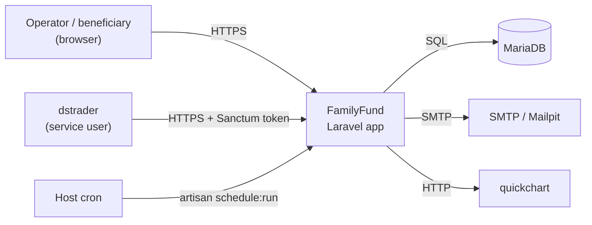
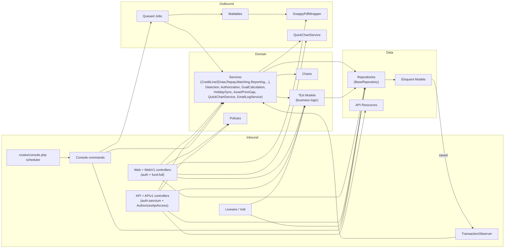

# Architecture

> Memory-bank doc — see root `AGENTS.md` for the index.
> **As of:** 2026-05-28. Counts and `path:line` references drift; verify with
> `git blame` / `git grep` before quoting in code review. Companion docs:
> [`../API_VS_WEB_COMPARISON.md`](../API_VS_WEB_COMPARISON.md),
> [`../API_VS_WEB_LOGIC_ANALYSIS.md`](../API_VS_WEB_LOGIC_ANALYSIS.md),
> [`../ACL_IMPLEMENTATION.md`](../ACL_IMPLEMENTATION.md),
> [`./ENGINEERING_DECISIONS.md`](./ENGINEERING_DECISIONS.md).

This doc follows arc42 chapters (1 Introduction, 3 Context, 5 Building Blocks,
6 Runtime, 7 Deployment, 8 Cross-cutting, 11 Risks) and C4 levels (System ↔
Container ↔ Component).

---

## 1. Introduction and goals (arc42 §1)

FamilyFund is a single Laravel 12 web app (PHP 8.2+) for tracking investment
fund shares, beneficiary accounts, portfolios, transactions, credit lines, and
quarterly reports. One container ships the entire HTTP + scheduler + queue
surface; persistence is MariaDB; PDF + chart + mail are sidecars. The driving
non-functional goals are **historical correctness** (every read is `as_of`-aware),
**tenant isolation** (cross-account/cross-fund access is denied by default), and
**reproducibility under the per-worktree dev workflow**.

Tech stack (`app1/family-fund-app/composer.json` + `package.json`):
- Backend: **Laravel 12** (`laravel/framework ^12.0`), PHP 8.2+
- Auth: `laravel/sanctum` ^4 (API), `pragmarx/google2fa-laravel` ^2.3 (2FA),
  `spatie/laravel-permission` ^6.24 (RBAC)
- Frontend: Blade + Livewire 3 + Volt + Bootstrap 5 + Tailwind, built with
  Vite (pinned to 6 per ED-0011)
- PDF: `knplabs/knp-snappy` → wkhtmltopdf bundled in the container image
- DB: MariaDB (LTS)

> Note on framework version: the project metadata in `composer.json` requires
> `^12.0`, but several in-repo comments (`AGENTS.md`, `CLAUDE.md`,
> `bootstrap/app.php` style) still say "Laravel 11". Both refer to the same
> minimal-`bootstrap/app.php` Laravel-11+ shape; trust `composer.json`.

## 2. Constraints (arc42 §2)

- **Run from `app1/`**, not from `app1/family-fund-app/` (that path holds a
  legacy Sail compose that is *not* used). The active stack is
  `app1/docker-compose.yml` plus a per-env overlay.
- **Tests must run in the container** (the DB is not host-reachable). Default
  `php artisan test` excludes the `@group nightly` slow suite (ED-0006).
- **Per-worktree previews** share the dev DB; destructive tests must use the
  isolated testpool (ED-0007).
- **No intentionally-public API endpoints** (ED-0012); `dstrader` authenticates
  with a system-admin Sanctum service token (ED-0016).

## 3. Context and scope (arc42 §3) — C4 System Context



External actors and systems:
- **Browser** — operators (admin / fund-admin / financial-manager) and
  beneficiaries.
- **dstrader** — companion trading system; pushes asset prices and portfolio
  asset compositions through `/api/asset_prices_bulk_update`,
  `/api/portfolio_assets_bulk_update`, `/api/portfolio_balances_bulk_update`,
  `/api/exchange_holidays/sync`.
- **Cron** — runs `php artisan schedule:run` inside the container; concrete
  schedule entries live in `routes/console.php` (see §6).
- **MariaDB** — primary store; also hosts the `jobs` table for the default
  `database` queue driver.
- **Mailpit (`mailhog` service) / SMTP** — dev catches mail; prod uses a real
  SMTP per `.env`.
- **quickchart** — chart-PNG sidecar consumed by PDF reports.

## 4. Repo layout (arc42 §5.0 / map)

```
FamilyFund/
├── app1/                                  # active stack lives here
│   ├── docker-compose.yml                 # familyfund + mariadb + mailhog + quickchart
│   ├── docker-compose.{dev,prod,acl,ffacl,dev2,env}.yml
│   ├── Dockerfile                         # PHP + wkhtmltopdf + pcov
│   └── family-fund-app/                   # Laravel app root
│       ├── app/                           # see §5 Building Blocks
│       ├── bootstrap/app.php              # routing + middleware wiring
│       ├── config/                        # familyfund.php, queue.php, snappy.php, …
│       ├── database/
│       │   ├── migrations/                # versioned schema
│       │   └── seeders/                   # TestBaselineSeeder, RolesAndPermissions…, Qa…
│       ├── routes/                        # web.php, api.php, auth.php, console.php, channels.php
│       ├── resources/                     # views/ (Blade), js/, css/, sass/, lang/, api_schemas/, model_schemas/
│       ├── public/                        # web root + built Vite assets
│       └── tests/                         # Feature/, APIs/, Repositories/, GoldenData/, Browser/, Unit/, …
├── docs/                                  # this memory bank
├── database/                              # DDL + anonymization SQL (prod_to_dev.sql)
├── specs/                                 # V1/V99 product specs
└── (root MDs: README, AGENTS, CLAUDE, SETUP, ACL_IMPLEMENTATION, …)
```

Two compose files exist: `app1/docker-compose.yml` (canonical) and
`app1/family-fund-app/docker-compose.yml` (legacy Sail, **unused** — do not
build from this one).

## 5. Building Block View (arc42 §5) — C4 Components

All paths in this section are relative to **`app1/family-fund-app/`**.

| Component | Path | Role |
|---|---|---|
| HTTP — Web (legacy CRUD) | `app/Http/Controllers/Web/` (~12 controllers) | Scaffolded CRUD controllers for shared/reference entities (assets, persons, etc.). |
| HTTP — WebV1 (rich UI) | `app/Http/Controllers/WebV1/` (~27 controllers; 19 named `*ControllerExt`, plus `AccountCreditLineController`, `OperationsController`, `UserRoleController`, `EmailController`, `ExchangeHolidayController`, `CreditLineMatchResolutionController`, `TransactionReversalController`, `AdminTransactionController`) | The real product surface: funds, accounts, transactions, credit lines, reports, ops. |
| HTTP — API (CRUD) | `app/Http/Controllers/API/` (~20 `*APIController`) | Generated REST resources behind `auth:sanctum`. |
| HTTP — APIv1 (extended) | `app/Http/Controllers/APIv1/` (~11 `*APIControllerExt`) | `as_of` queries, bulk updates, `funds/setup`, `dstrader`-facing endpoints. |
| HTTP — Auth scaffolding | `app/Http/Controllers/Auth/` + `routes/auth.php` | Login, registration, password reset, email verification, 2FA confirmation. |
| Home/dashboard | `app/Http/Controllers/HomeController.php` | Landing redirect glue. |
| Form requests | `app/Http/Requests/` | Per-action validation. |
| Middleware | `app/Http/Middleware/` — `RedirectStrayImpersonation`, `SetFundPermissions`, `EnsureTwoFactorIsCompleted`, `RequireFullFundAccess` (alias `fund.full`) | Wired in `bootstrap/app.php`. |
| API resources | `app/Http/Resources/` | JSON shapes returned by API controllers. |
| Controller traits | `app/Http/Controllers/Traits/` (~24 traits) | Cross-cut helpers: `AuthorizesApiAccess`, `BulkStoreTrait`, `AccountSelectorTrait`, PDF builders (`AccountPDF`, `FundPDF`, …), `OverviewTrait`, `PerformanceTrait`, etc. |
| Livewire / Volt | `app/Livewire/` (`Actions/`, `Forms/`) + Volt SFCs under `resources/views/livewire/` | Login form + scattered interactive UI. |
| Domain models | `app/Models/` (~63 files) | Eloquent models; many have a paired `*Ext` carrying business logic (ED-0008). |
| Repositories | `app/Repositories/` (~37 `*Repository` extending `BaseRepository`) | The InfyOm-generator-shaped data-access layer (ED-0008). |
| Domain services | `app/Services/` — `CreditLine/{Draw,Repay,Matching,Reporting,Adjust,Cancel,Reverse,Simulation,Settings,Support,Exceptions}`, `Detection/`, `AuthorizationService`, `GoalCalculationService`, `HolidaySyncService`, `AssetPriceGapService`, `QuickChartService`, `EmailLogService`, `SnappyPdfWrapper` | Multi-step domain logic that doesn't fit in one `*Ext`. |
| Policies | `app/Policies/` — `Account`, `Fund`, `Transaction`, `AccountCreditLine` | Per-model authorize gates, wired in `app/Providers/AuthServiceProvider.php`. |
| Observers | `app/Observers/TransactionObserver.php` | Hooks `TransactionExt::saved` → `TransactionDetectionService`; recursion-guarded. |
| Listeners | `app/Listeners/LogQueueJobCompletion.php` (subscribed in `AppServiceProvider::boot()`), `LogSentEmail.php` (Laravel 11+ event auto-discovery via the `MessageSent` type-hint). |
| Mailables | `app/Mail/` (incl. `CreditLine/` subfolder) | One class per mailable; queueable. |
| Jobs | `app/Jobs/` — `SendAccountReport`, `SendFundReport`, `SendTradeBandReport`, `FetchDeposits`, `CreditLine/{ScanReminders,ScanLatePayments,SendStatusUpdate}Job` | Queued work (queue driver = `database`, `config/queue.php`). |
| Console commands | `app/Console/Commands/` — `RunScheduledJobs`, `SyncExchangeHolidays`, `DetectLateCreditLinePayments`, `RepairCancelledPreEffectivePayments`, `ResendReport`, `GenerateChartImage`, `Security{Dev,Service}TokenCommand` | One-shot ops + security token issuance. |
| Scheduler | `routes/console.php` (Laravel 11+ shape; legacy `App\Console\Kernel::schedule()` is **not** wired — see §6). |
| Charts | `app/Charts/` — `Line`, `Bar`, `Doughnut`, `Progress`, `BaseChart` | Server-rendered chart configs handed to QuickChart. |
| View components | `app/View/Components/` + `resources/views/components/` | Shared Blade components. |
| Providers | `app/Providers/{App,Auth,Volt}ServiceProvider.php` | Bindings (`ScheduleAdvancer` → `RepayService`, `snappy.pdf.wrapper` → `SnappyPdfWrapper`), policies, password rules, event subscriber, `TransactionExt::observe(TransactionObserver)`. |
| Support / utils / traits (root) | `app/Support/UIColors.php`, `app/Utils/ResponseUtil.php`, `app/Traits/FailedValidationErrorTrait.php` | Misc helpers. |

### Layer conventions (aspirational, not strictly enforced)

These are the *intended* rules. They are widely followed but **not** invariants
— a handful of WebV1/APIv1 controllers reach for Eloquent (`AccountExt::findOrFail`,
`TransactionExt::where`, `DB::transaction`, direct `save()`) where the
repository layer is missing a method (e.g.
`app/Http/Controllers/WebV1/AdminTransactionController.php`, the
`AssetPriceAPIControllerExt::bulkStore` path). Treat the conventions as the
default and the exceptions as known debt.

1. **HTTP layer composes Repositories, Services, and `*Ext` Models.**
   Controllers inject a repository in the constructor and validate via
   `Http/Requests`. Use of bare Eloquent in a controller is a smell, not a
   bug, but is present in places.
2. **Repositories are the preferred write path.** Every repo extends
   `BaseRepository` and exposes `getFieldsSearchable()`. Services and
   controllers should prefer repository calls over `Model::save()` /
   `DB::table()`.
3. **Business logic lives in `*Ext` Models or Services** (ED-0008). A plain
   model (`app/Models/Account.php`) only declares fillables/relations; its
   `*Ext` (`app/Models/AccountExt.php`) carries `sharesAsOf($now)`,
   `valueAsOf($now)`, NAV math, etc.
4. **Authorization is two-layered.** Route-level `auth` + `fund.full`
   middleware (`bootstrap/app.php` registers `fund.full` →
   `RequireFullFundAccess`); inside the controller a second
   `AuthorizationService` / `AuthorizesApiAccess` pass scopes the query and
   `abort(403)`s on cross-tenant access (ED-0003, ED-0004; see
   `../ACL_IMPLEMENTATION.md`).

## 6. Entry points and layer map (arc42 §5 / Runtime §6)

### 6.1 Routes file → controllers map

| Routes file | Auth posture | Controllers reached | Response shape |
|---|---|---|---|
| `routes/web.php` (~440 lines, ~130 declarations) | `auth` group on everything substantive; many money/management routes additionally require `fund.full` (ED-0015). Dev-only `/dev-login/{redirect?}` is gated to `local\|dev\|testing`. | `App\Http\Controllers\Web\*`, `App\Http\Controllers\WebV1\*`, `HomeController` | HTML (Blade) + `Flash::success/error` + redirects |
| `routes/auth.php` (50 lines) | Auth scaffolding (login, register, password, email verify, 2FA) | `App\Http\Controllers\Auth\*` | HTML + redirects |
| `routes/api.php` (~124 lines) | One `Route::middleware('auth:sanctum')->group(...)` wrapping the file. No public endpoints (ED-0012). | `App\Http\Controllers\API\*`, `App\Http\Controllers\APIv1\*` | JSON (Laravel API Resources) |
| `routes/console.php` | n/a | Scheduler entries (see §6.3) + closure-based artisan commands | n/a |
| `routes/channels.php` | n/a | Broadcast channel definitions | n/a |

### 6.2 Web ↔ API differences

- Repositories: API and Web call the **same** repositories. The business-logic
  body is shared.
- Authorization: Web has more `$this->authorize(...)` policy calls; API leans
  on the `AuthorizesApiAccess` trait for object-level scoping plus
  `requireAdminWrite()` for reference-data writes (ED-0016).
- Reference-data writes (`assets`, `asset_prices`, `matching_rules`,
  `schedules`, `change_logs`, `asset_change_logs`, `exchange_holidays`) are
  **system-admin-only** behind the `familyfund.enforce_admin_writes` flag.
  `dstrader` holds the system-admin service token.
- Date-range routes pin `as_of` to `YYYY-MM-DD` in `[1970, 2100]` via regex
  on `routes/web.php` so out-of-range inputs 404 at routing instead of
  500-ing on downstream date math.
- Middleware stack on `web`:
  - prepend: `RedirectStrayImpersonation`
  - append: `SetFundPermissions`, `EnsureTwoFactorIsCompleted`
  - aliases: `role`, `permission`, `role_or_permission` (Spatie), `fund.full`
    (`RequireFullFundAccess`).

For the per-endpoint differential, see [`../API_VS_WEB_COMPARISON.md`](../API_VS_WEB_COMPARISON.md)
and [`../API_VS_WEB_LOGIC_ANALYSIS.md`](../API_VS_WEB_LOGIC_ANALYSIS.md).

### 6.3 Scheduler (Runtime view)

The Laravel 11+ minimal `bootstrap/app.php` means **the legacy
`App\Console\Kernel::schedule()` is not wired**. The active schedule lives in
`routes/console.php`:

- `security:service-token --check-expiry --warn-days=14` — daily at 06:30
- `security:service-token --prune-expired` — weekly Monday 06:35

`App\Console\Kernel::schedule()` still contains older entries
(`credit_lines.scan_reminders`, `credit_lines.scan_late_payments`,
`credit_lines.send_status_update`) but **they do not run** under the current
bootstrap. `php artisan schedule:list` is the source of truth.

TODO(verify): decide whether to wire the credit-line scans into
`routes/console.php` or delete the dead `App\Console\Kernel::schedule()` body.
Tracked separately from this doc.

### 6.4 Queue runtime

- Default queue connection is `database` (`config/queue.php` →
  `QUEUE_CONNECTION=database`).
- A queue worker is required in any env that sends mail or runs the
  credit-line scan jobs.
- `TransactionObserver` runs **synchronously** inside the request that saved
  the transaction (not queued), and may itself persist further changes
  (matcher → `account_credit_line_id`); a static reentrancy flag in
  `TransactionObserver` prevents infinite recursion.

## 7. Service boundaries — C4 Component diagram (arc42 §5.2)



Key relationships:
- **Inbound HTTP** has two doors only — browser (Web/WebV1) and `dstrader`-style
  clients (API/APIv1). No webhook ingress.
- **Detection pipeline** is observer-driven: any `TransactionExt::save()`
  fires `TransactionObserver` → `TransactionDetectionService` →
  classifiers in `app/Services/Detection/` (`ContributionClassifier`,
  `CreditLineClassifier`) → optional credit-line matching. Matcher writes
  back via the same observer with a recursion guard.
- **Credit-line bounded context** lives entirely under
  `app/Services/CreditLine/`. The `ScheduleAdvancer` contract is bound to
  `RepayService` in `AppServiceProvider::register()` so the wave-1b matching
  layer can advance schedules without depending on wave-1a directly.
- **PDFs** route through `App\Services\SnappyPdfWrapper` (bound in
  `AppServiceProvider`) → `wkhtmltopdf` binary inside the container.
  **Charts** route through `QuickChartService` → the `quickchart` sidecar.

## 8. Deployment view (arc42 §7)

One Laravel container plus three sidecars in `app1/docker-compose.yml`:

- `familyfund` — the Laravel app (custom Dockerfile, includes wkhtmltopdf
  and pcov for coverage). Volume-mounts `family-fund-app/` into `/app`.
- `mariadb` (container `db`) — primary store.
- `mailhog` — Mailpit (drop-in MailHog replacement). The service **key** is
  kept as `mailhog` so `MAIL_HOST=mailhog` continues to resolve; the
  `container_name` varies per env (`mail-dev`, `mail-acl`, …).
- `quickchart` — chart-image renderer (`http://quickchart:3400`).

Services reach each other by **compose service name**, not by
`container_name`. Per-env overlays:

- `docker-compose.dev.yml` / `.dev2.yml` — local dev (single + secondary)
- `docker-compose.prod.yml` — production deploy via
  `dstrader-docker/local/deploy_ff.sh` + `server/dev/run_familyfund.sh prod`
- `docker-compose.acl.yml` / `.ffacl.yml` — ACL test stacks
- `docker-compose.env.yml` — per-nickname env-var sweeps (each worktree
  preview gets its own `DB_DATABASE`/`FF_NICKNAME`/`FF_BUILD_*`)

Multiple logical DBs on the same MariaDB server:
- `familyfund` — prod
- `familyfund_dev` — shared dev DB (used by all preview-pool slots)
- `familyfund_testN` — isolated testpool slots (ED-0007), reseeded by
  `migrate:fresh` + `TestBaselineSeeder` on every claim (ED-0014).

## 9. External integrations

- **MariaDB** — primary data store + `database` queue + sessions.
- **dstrader** — separate trading system; system-admin Sanctum service token
  + the bulk-update endpoints listed in §3. See
  `docs/runbooks/ff-service-token-rotation.md` for token rotation.
- **Exchange holidays** — synced via `SyncExchangeHolidays` and
  `HolidaySyncService`; exposed at `/api/exchange_holidays/{exchange}/{year}`
  and `POST /api/exchange_holidays/sync` (system-admin write).
- **wkhtmltopdf** — bundled in the container image; invoked through
  `knplabs/knp-snappy` + `SnappyPdfWrapper`.
- **quickchart** — sidecar service for chart PNGs used by PDFs and
  some Blade views.
- **Mailpit (`mailhog` service)** — dev mail trap; prod uses real SMTP.
- **dstrader-docker** — out-of-repo deploy scripts (not in this repo):
  `dstrader-docker/local/deploy_ff.sh` (deploy) and
  `dstrader-docker/server/dev/run_familyfund.sh prod` (start on the prod
  host). See `CLAUDE.md` for the prod runbook.

## 10. Cross-cutting concepts (arc42 §8)

- **Authorization** — see §5 layer rule 4 and `../ACL_IMPLEMENTATION.md`.
- **Historical reads** — every `as_of` endpoint returns the state at a
  given date; backed by `*Ext::sharesAsOf`, `valueAsOf`, `shareValueAsOf`,
  etc. The `as_of` route param is regex-pinned.
- **Multi-stack overrides** — `php artisan serve` only forwards a
  whitelist of env vars; `AppServiceProvider::boot()` extends the whitelist
  with `DB_*` and `FF_NICKNAME` / `FF_BUILD_*` so each per-worktree preview
  stack uses its own DB and shows its branch/build banner.
- **Permissions** — `spatie/laravel-permission` (roles + permissions
  tables seeded by `RolesAndPermissionsSeeder`); QA users seeded by
  `QaTestUsersSeeder`.
- **2FA** — `pragmarx/google2fa-laravel` + the appended
  `EnsureTwoFactorIsCompleted` middleware.
- **Secrets** — encrypted env files (`*.sops`) committed to the *secrets*
  repo (`familyfund-secrets`); plaintext is git-ignored. See ED-0001 /
  ED-0002 / ED-0017.

## 11. Risks and technical debt (arc42 §11)

- **Dead scheduler entries** — `App\Console\Kernel::schedule()` still
  contains entries that no longer run (see §6.3). Risk: someone reads the
  Kernel and assumes the credit-line jobs are scheduled when they are not.
- **Repository discipline drift** — direct Eloquent / `DB::transaction` /
  `Model::save()` calls in WebV1 and APIv1 controllers violate the
  "repositories are the preferred write path" convention; cleanup is
  ad-hoc rather than a tracked epic.
- **Two compose files** — `app1/family-fund-app/docker-compose.yml` is a
  Sail leftover and confuses new contributors. Risk: someone builds from
  the wrong file.
- **Volatile counts in this doc** — controller / repository / route counts
  drift; verify with `git grep` / `ls | wc -l` before quoting in a PR
  review. The "as of" date at the top should be bumped on substantive
  rewrites.
- **Planned docs not yet written** — `docs/DATABASE.md`,
  `docs/SECURITY.md`, `docs/OPERATIONS.md`, `docs/DOMAIN_GLOSSARY.md`,
  `docs/INTEGRATIONS.md` are tracked in the memory-bank umbrella (Board #1)
  but do not exist yet. Treat any references to them as forward pointers,
  not live links.

## 12. Out of scope for this doc

- Detailed schema / ERD → planned `docs/DATABASE.md`.
- Deploy + runbooks → `docs/runbooks/` and `CLAUDE.md` prod section.
- Security posture → `docs/security/`, `../SECURITY_NEXT_STEPS.md`,
  ED-0001 / ED-0002 / ED-0017.
- Per-decision history → `./ENGINEERING_DECISIONS.md`.
- Per-controller diff → `../API_VS_WEB_COMPARISON.md`,
  `../API_VS_WEB_LOGIC_ANALYSIS.md`.
- Credit-line domain narrative → `credit_lines/` subfolder.

TODO(scope-clarify): The ticket's "Done when" list includes "linked from
root `AGENTS.md`", but the parallel-agent brief reserves the root
`AGENTS.md` for the separate scaffold ticket. This doc is therefore *not*
linked from root yet — that link should land with the scaffold ticket's
index section.
