# DATABASE

Schema reference for FamilyFund. Companion to [`AGENTS.md`](../AGENTS.md) ("Tech Stack"
+ "Database Backup") and [`../Transactions.md`](../Transactions.md) (transaction-flow
semantics). For "why a column exists" and migration backstory see
[`ENGINEERING_DECISIONS.md`](ENGINEERING_DECISIONS.md).

## Engine & connection

- **DBMS:** **MariaDB**. The compose image is pinned to `mariadb:lts`
  (`app1/docker-compose.yml:3`); the latest checked-in DDL dump was produced
  against `11.8.5-MariaDB-ubu2404` (`../database/familyfund_ddl_20260110.sql:6`)
  — the dump version is informational, not a compose constraint. All tables
  are `ENGINE=InnoDB`, `DEFAULT CHARSET=utf8mb4 COLLATE=utf8mb4_unicode_ci`.
- **Laravel driver:** `mariadb` by default — see
  `app1/family-fund-app/config/database.php:19` (`DB_CONNECTION=mariadb`,
  `DB_CHARSET=utf8mb4`, `DB_COLLATION=utf8mb4_unicode_ci`). A `mysql` connection
  is also configured for legacy callers; both point at the compose `mariadb`
  service from `app1/docker-compose.yml`.
- **Dev defaults:** database `familyfund_dev`, port `3306`. The app container
  connects as `DB_USERNAME=root` (`app1/docker-compose.dev.yml:17`) by default;
  the MariaDB service also provisions a `famfun_dev` user (`docs/SETUP.md:60`)
  used by host-side scripts like `dump_data.sh`.
- **Testing DBs:** isolated `familyfund_testN` databases under the testpool
  (ED-0007); each slot runs `migrate:fresh --seed=…TestBaselineSeeder` rather
  than restoring a real-data dump (ED-0014).

## Multi-tenancy model

FamilyFund is **single-database multi-tenant**, with `funds.id` as the tenant
key. Tenancy is enforced in PHP (Spatie permissions + `AuthorizationService`),
not via row-level security or separate schemas:

- Each fund-scoped row carries a `fund_id` (direct column) or links to one
  via a foreign-key chain (`portfolios.fund_id` / `fund_portfolio` pivot,
  `accounts.fund_id`, `transactions → accounts → fund_id`, etc.).
- Roles are **fund-scoped** via Spatie's "teams" mode with the
  `team_foreign_key` overridden to `fund_id`
  (`app1/family-fund-app/config/permission.php:96`). `roles.fund_id` and
  `model_has_roles.fund_id` / `model_has_permissions.fund_id` pin a role to
  a specific fund (`app1/family-fund-app/database/migrations/2026_01_11_211156_create_permission_tables.php`,
  `2026_05_24_000001_backfill_account_owner_beneficiary_roles.php`). It is
  a Spatie team-scope column (not a declared FK to `funds.id`); the package
  enforces team filtering in PHP. A user can hold different roles on
  different funds; "system admin" is the global bypass.
- The `fund.full` capability gates management surfaces (ED-0003, ED-0015) and
  controller-level scoping (`AuthorizationService::scopeByFundColumn`,
  `scopeByAccountRelation`, `scopePortfoliosQuery`) filters every list
  endpoint by the caller's accessible fund IDs. Deny-by-default: a query with
  no matching scope returns zero rows.
- One pivot deserves note: `portfolios` historically had a single `fund_id`;
  the `fund_portfolio` pivot
  (`2026_01_30_120000_create_fund_portfolio_table.php`) added many-to-many,
  and any portfolio scoping must check **both** the legacy column and the
  pivot (`AuthorizesApiAccess::scopePortfolioQuery`).

## Accounting tables

> **"Members" mapping.** Ticket #58 lists "members" as an accounting concern;
> there is no `members` table. The member concept is split across
> `users` (auth principal), `persons` (PII / family-tree identity), `accounts`
> (the share-holding unit owned by a user and tied to a beneficiary person),
> and `account_contact_persons` (additional contact persons per account).

### Identity & access

| Table | Purpose | Key relations |
|---|---|---|
| `users` | Auth principal (Laravel default). `email` unique, `person_id` links to PII. | → `persons` |
| `persons` | PII (name, birthday, legal guardian self-FK). Owns `addresses`, `phones`, `iddocuments`. | self-FK `legal_guardian_id` |
| `accounts` | Beneficiary account — the unit that holds fund shares. `code` (string, ~15) is the human handle; `fund_id` pins the tenant; `user_id` is the auth owner; `beneficiary_id`/`account_contact_persons` link to people. | → `funds`, `users`, `persons` |
| `funds` | Tenant root. `name`, `goal`, `independence_mode` (`perpetual`/`countdown`), `independence_target_date`, `4_pct_goal`, `withdrawal_rate`, `expected_growth_rate`. | (root) |
| `roles`, `permissions`, `model_has_roles`, … | Spatie permission stack, team-scoped by fund. | → `funds` (team) |

### Investments & pricing

| Table | Purpose |
|---|---|
| `assets` | Stocks/crypto/cash/real-estate. Unique on `(source, name, type)`. `display_group`, soft-deletes. |
| `asset_prices` | Temporal price history per asset: `(start_dt, end_dt)` with `end_dt='9999-12-31'` for the active row. |
| `portfolios` | Asset bucket owned by a fund (and now also by the `fund_portfolio` pivot). Unique on `(fund_id, source)` after `2026_01_19_231009_fix_portfolio_source_unique_constraint.php`. |
| `portfolio_assets` | Temporal positions: shares of an asset held by a portfolio, `(start_dt, end_dt)`. |
| `portfolio_balances` | Temporal portfolio cash valuation: `(portfolio_id, start_dt, end_dt)` indexed together. |
| `trade_portfolios` / `trade_portfolio_items` | Rebalancing targets fed to dstrader: `cash_target`, `cash_reserve_target`, `max_single_order`, `minimum_order`, per-item `target_share`/`deviation_trigger`. |

### Shares ledger (the core accounting)

The fund-share ledger is **event-sourced** by `transactions` and projected into
the temporal `account_balances` history.

- **`transactions`** — append-only event log.
  - `type` ∈ {`PUR`,`SAL`,`BOR`,`REP`,`MAT`,`INI`} (purchase/sale/borrow/
    repay/match/initial; validated in
    `app1/family-fund-app/app/Models/Transaction.php:86-99`).
  - `status` ∈ {`C` cleared, `P` pending, `S` skipped}. `flags` (`A`/`C`/`U`)
    plus the credit-line columns `account_credit_line_id`,
    `credit_line_match_status` (`auto_matched|manual|ambiguous|unmatched`),
    and `reversed` (added by
    `app1/family-fund-app/database/migrations/2026_05_13_000005_add_credit_line_columns_to_transactions.php`).
  - `value` decimal(13,2) USD, `shares` decimal(19,4) — fund shares, not stock
    shares. `timestamp` is the business-event time (rules clamp it to roughly
    "after last year, before tomorrow"); `created_at`/`updated_at` are
    system-time. Conventionally append-only at the app layer (a reversal
    writes a new row plus a `transaction_reversals` audit + sets
    `transactions.reversed=true`), but the rows are soft-deletable
    (`deleted_at`) — there is no DB-level append-only constraint.
  - Optional `scheduled_job_id` ties recurring transactions back to a
    `scheduled_jobs` row.

- **`account_balances`** — temporal projection (one row per
  `(account_id, type, start_dt, end_dt)` interval). The currently-active row
  has `end_dt='9999-12-31'`. `transaction_id` points to the event that
  created it. `previous_balance_id` is a singly-linked list to the prior
  row's id, added by
  `app1/family-fund-app/database/migrations/2025_01_20_000005_add_previous_balance.php`
  so a reversal can find what to restore. Historical share counts as of any
  date are reconstructed by scanning the (start_dt, end_dt) intervals — the
  pattern used throughout the codebase as the `as_of` parameter.

- **`matching_rules`** + **`account_matching_rules`** — contribution-match
  rules: a `match_percent` over a `(dollar_range_start, dollar_range_end)`
  band, active over `(date_start, date_end)`. Attached to an account through
  the pivot (unique on `(account_id, matching_rule_id)` after
  `app1/family-fund-app/database/migrations/2025_01_12_000000_unique_acct_mr.php`).
  A matched `PUR` generates a `MAT` transaction via `transaction_matchings`.
  The `applies_to_rep` flag
  (`app1/family-fund-app/database/migrations/2026_05_15_000001_add_applies_to_rep_to_matching_rules.php`)
  toggles whether credit-line repayments are matched.

- **`transaction_matchings`** — `(matching_rule_id, transaction_id,
  reference_transaction_id)` links a `MAT` transaction to the rule and the
  original `PUR` it matches.

- **`cash_deposits`** + **`deposit_requests`** — operator-side cash tracking
  before/after a deposit lands. `cash_deposits.status` ∈
  {`PENDING`,`DEPOSITED`,`ALLOCATED`,`COMPLETED`,`CANCELLED`} (extended by
  `app1/family-fund-app/database/migrations/2026_01_10_181834_add_completed_cancelled_to_cash_deposits_status.php`).
  A deposit, once allocated, points at the `transactions.id` it became.

### Allocations (goals + disbursements)

| Table | Purpose |
|---|---|
| `goals` | Reusable goal template: `target_type` (`TOTAL` or `4PCT`), `target_amount`, `target_pct`, `(start_dt, end_dt)`. |
| `account_goals` | Pivot tying a goal to an account (soft-deletes). Goal "Current" uses **net** shares (OWN − BOR) per ED-0009. |
| `accounts.disbursement_cap` | Per-account cap on outflows (decimal(5,4); added `app1/family-fund-app/database/migrations/2026_01_09_224152_add_disbursement_cap_to_accounts.php`, defaulted to 0 by `2026_01_10_171246_set_null_disbursement_cap_to_zero.php`). |

### Credit lines (the "Loan Share" subsystem)

User-facing label is "Loan Share" (ED-0010); tables keep the
`credit_line` name to avoid a churn rename.

| Table | Purpose | Key columns |
|---|---|---|
| `account_credit_lines` | One line per account-loan. | `principal_shares`, `outstanding_shares`, `term_months`, `origination_date`, `maturity_date`, `payment_frequency` (`monthly|quarterly|annual`), `status` (`active|paid_off|cancelled`), `imputed_interest_rate`, `nickname`, `delay_notification_enabled`. Index `(account_id, status)`. Soft-deletes. |
| `account_credit_line_balances` | Temporal history for `outstanding_shares` — one row per `(line, [start_dt, end_dt))`, mirroring `account_balances`. Used by `FundReceivableCalculator` to reconstruct the receivable at any past date. Index `acl_balances_line_dt_idx (account_credit_line_id, start_dt, end_dt)`. Backfilled idempotently by `app1/family-fund-app/database/migrations/2026_05_13_000007_create_account_credit_line_balances_table.php`. |
| `credit_line_payments` | Amortization schedule. | `due_date`, `shares_due`, `status` (`scheduled|paid|partial|late|cancelled`), `paid_transaction_id` (denormalized cache), `generation` (added `app1/family-fund-app/database/migrations/2026_05_19_000003_add_generation_to_credit_line_payments.php`). Indexes on `(account_credit_line_id, status)` and `due_date`. |
| `credit_line_payment_allocations` | Many-to-many ledger from REP `transactions` to `credit_line_payments` rows — the *unit of truth* (the `paid_transaction_id` column is a derived cache). One REP can split across schedule rows; one schedule row can be filled by multiple REPs. `shares` decimal(19,4). Non-unique indexes on `credit_line_payment_id` and `transaction_id` only — there is **no** unique key on `(credit_line_payment_id, transaction_id)`, so the same `(payment, transaction)` pair could theoretically be inserted twice; uniqueness is an application invariant, not a DB constraint. |
| `credit_line_adjustments` | Audit log of term/frequency/maturity changes. Snapshots old vs new term/frequency/maturity/planned_payoff plus `outstanding_shares_at_adjustment`, `adjusted_by_user_id`, `reason`. Indexed by line and by `adjusted_at`. |
| `credit_line_delay_notifications` | Late-payment reminder tracking. |
| `transaction_reversals` | One-row-per-reversed-transaction (unique on `transaction_id`). Captures `original_target_credit_line_id`, `reversed_at`, `reversed_by_user_id`, `reason`. Cooperates with `transactions.reversed`. |
| `matching_reminder_logs` | Operator-facing reminder log when matching needs review. |

`BOR` transactions draw from a line; `REP` transactions pay it down. Matching
behavior on REP is per-rule (`matching_rules.applies_to_rep`): when set,
`AccountMatchingRuleExt::match()`
(`app1/family-fund-app/app/Models/AccountMatchingRuleExt.php:82-105`) falls
back from `value` to `shares × shareValueAsOf(timestamp)` so wave-1a REPs
(`value=0`, cash leg deferred) still match. Default is opt-out per rule —
see `credit_lines/matching_on_repayment.md` for the design note.

### Money flow

A separate money-flow subsystem (Wise/PIX inbound, USD-bank/broker outbound,
attribution to credit lines) is **planned but not yet schema-resident** — see
`../money_flow_plan.md` and `../money_flow_runbook.md`. Until v1 lands the
nearest schema surface is `cash_deposits` + `deposit_requests` (operator
tracks deposits manually and binds them to a `transactions` row). New
money-flow tables (e.g. `mf_audit_log`, recipient registry,
`pending_attribution` queue) will arrive via their own migrations.
`TODO(scope-clarify): once a `docs/SUBSYSTEM_money_flow.md` doc exists,
link it here.`

### Supporting / ops tables

`schedules` / `scheduled_jobs` / `fund_report_schedules` / `report_schedules`
drive recurring jobs. `change_log` / `asset_change_logs` /
`operation_logs` / `login_activities` / `holidays_sync_logs` are audit
streams. `exchange_holidays` is shared reference data (auth-locked writes —
ED-0016). `jobs` / `failed_jobs` are the standard Laravel queue tables.
`personal_access_tokens` carries `expires_at` after
`app1/family-fund-app/database/migrations/2026_05_24_000000_add_expires_at_to_personal_access_tokens_table.php`
(used by the dstrader service tokens — ED-0016).

## ERD (core edges)

Not exhaustive — only the load-bearing relations for the share ledger,
credit-line subsystem, and tenant edges. Crow's-foot is implied: the
arrow points from the FK side to the referenced side.

```mermaid
erDiagram
    funds ||--o{ accounts : "fund_id"
    funds ||--o{ portfolios : "fund_id + fund_portfolio pivot"
    funds ||--o{ roles : "fund_id (Spatie team)"

    persons ||--o{ users : "person_id"
    persons ||--o{ accounts : "beneficiary_id"
    persons ||--o{ account_contact_persons : "person_id (cascade)"
    persons ||--o{ addresses : "person_id (cascade)"
    persons ||--o{ phones : "person_id (cascade)"
    persons ||--o{ iddocuments : "person_id (cascade)"
    persons ||--o{ persons : "legal_guardian_id (self-FK)"

    users ||--o{ accounts : "user_id"
    accounts ||--o{ transactions : "account_id"
    accounts ||--o{ account_balances : "account_id"
    accounts ||--o{ account_goals : "account_id"
    accounts ||--o{ account_matching_rules : "account_id"
    accounts ||--o{ account_credit_lines : "account_id"
    accounts ||--o{ cash_deposits : "account_id"
    accounts ||--o{ deposit_requests : "account_id"

    transactions ||--o{ account_balances : "transaction_id"
    transactions ||--|| transaction_reversals : "transaction_id (UNIQUE)"
    transactions ||--o{ credit_line_payment_allocations : "transaction_id"
    transactions ||--o{ transaction_matchings : "transaction_id + reference_transaction_id"

    matching_rules ||--o{ account_matching_rules : "matching_rule_id"
    matching_rules ||--o{ transaction_matchings : "matching_rule_id"

    account_credit_lines ||--o{ credit_line_payments : "account_credit_line_id"
    account_credit_lines ||--o{ account_credit_line_balances : "account_credit_line_id"
    account_credit_lines ||--o{ credit_line_adjustments : "account_credit_line_id"
    account_credit_lines ||--o{ transactions : "account_credit_line_id (BOR/REP)"
    credit_line_payments ||--o{ credit_line_payment_allocations : "credit_line_payment_id"

    portfolios ||--o{ portfolio_assets : "portfolio_id"
    portfolios ||--o{ portfolio_balances : "portfolio_id"
    portfolios ||--o{ trade_portfolios : "portfolio_id"
    assets ||--o{ portfolio_assets : "asset_id"
    assets ||--o{ asset_prices : "asset_id"
    trade_portfolios ||--o{ trade_portfolio_items : "trade_portfolio_id"

    goals ||--o{ account_goals : "goal_id"

    cash_deposits ||--o{ deposit_requests : "cash_deposit_id"
    cash_deposits ||--o{ transactions : "transaction_id (post-allocation)"

    schedules ||--o{ scheduled_jobs : "schedule_id"
    scheduled_jobs ||--o{ transactions : "scheduled_job_id"
```



Money-flow tables are intentionally absent — see the "Money flow" section
above; the planned subsystem will draw its own ERD when it ships.

## Migrations

- **Location:** `app1/family-fund-app/database/migrations/` (one file per
  schema change, named with their UTC date). The oldest are the
  Laravel/Jetstream baseline (`2014_10_…`); business tables start
  `2022_01_07_…`. Count the live set with
  `ls app1/family-fund-app/database/migrations/ | wc -l`.
- **Apply (dev / inside the `familyfund` container):**
  ```bash
  docker exec familyfund php artisan migrate
  docker exec familyfund php artisan migrate:fresh --seed   # destructive
  ```
  Both `migrate` and `migrate:fresh` are also invoked by the testpool slot
  setup (`~/.familyfund-pool/testpool.sh claim`) — see ED-0007/ED-0014.
- **Restore from prod dump:** `app1/family-fund-app/bin/prod-to-dev.sh` is
  the canonical entry point — restores `../database/prod/familyfund_prod_data_*.sql`,
  applies `../database/prod_to_dev.sql` (anonymizer), runs `php artisan migrate
  --force`, then seeds `RolesAndPermissionsSeeder` + `QaTestUsersSeeder`.
- **DDL backup / verification:**
  `app1/family-fund-app/generators/dump_ddl.sh dev` writes the dated
  `../database/familyfund_ddl_YYYYMMDD.sql` checked-in DDL snapshot. **Drift
  note:** the latest snapshot (`../database/familyfund_ddl_20260110.sql`)
  predates the credit-line and permission migrations, so the live dev DB is
  the authoritative shape —
  `TODO(verify): refresh DDL dump post-credit-lines so the checked-in snapshot
  reflects the current schema.`
- **Seeders of note:**
  - `Database\Seeders\TestBaselineSeeder` — synthetic baseline for the test
    suite (ED-0014); avoids shipping real PII.
  - `RolesAndPermissionsSeeder` — defines the fund-scoped role/permission
    matrix (re-runnable; the backfill migration above calls into it).
  - `DstraderServiceUserSeeder` — system-admin service user for the
    cross-repo dstrader integration (ED-0016).

## Indexes & constraints that matter for correctness

- **Temporal active-row convention.** Every "history" table
  (`account_balances`, `account_credit_line_balances`, `asset_prices`,
  `portfolio_assets`, `portfolio_balances`, `trade_portfolios`) uses
  `(start_dt, end_dt)` with `end_dt='9999-12-31'` for the live row. Range
  queries assume **no two open intervals** for the same key — preserved by
  application code, not a unique index (`account_credit_line_balances`
  explicitly forgoes a `(line, start_dt)` unique because a same-day
  draw+repay can legitimately leave a zero-length closed interval — see the
  comment in `app1/family-fund-app/database/migrations/2026_05_13_000007_create_account_credit_line_balances_table.php:42-48`).
- **Tenant correctness.** `accounts.fund_id`, `portfolios.fund_id` +
  `fund_portfolio` pivot, and the Spatie team scope on `roles.team_id` are
  the load-bearing tenancy edges. A query that touches a fund-scoped table
  without going through `AuthorizationService::scopeBy*` is a multi-tenant
  bug (ED-0003) — the AclMatrix golden test guards GET routes
  (`app1/family-fund-app/tests/Feature/AclMatrixTest.php`).
- **Uniqueness guards.**
  - `users(email)` unique.
  - `assets(data_source, name, type)` unique → no duplicate symbol per
    upstream data source. The original `(source, name, type)` unique was
    swapped to `(data_source, name, type)` (key name
    `unique_asset_data_source`) by
    `app1/family-fund-app/database/migrations/2026_01_30_000003_update_asset_unique_constraint.php`,
    after `…000002_deduplicate_assets.php` cleared collisions.
  - `portfolios(fund_id, source)` unique — was `(source)` only and let two
    funds collide; fixed by
    `app1/family-fund-app/database/migrations/2026_01_19_231009_fix_portfolio_source_unique_constraint.php`.
  - `account_matching_rules(account_id, matching_rule_id)` unique — prevents
    double-matching after de-dup migration.
  - `transaction_reversals.transaction_id` unique — a transaction can be
    reversed exactly once.
  - **No DB-level uniqueness on `credit_line_payment_allocations`** beyond
    the surrogate PK; `(credit_line_payment_id, transaction_id)` uniqueness
    is an application invariant (`RepayService`). Worth knowing if you ever
    backfill or restore this table from another source.
- **Foreign keys.** Almost every relation declares an FK (InnoDB enforces),
  giving cascade behavior where it matters: `addresses`, `phones`,
  `iddocuments`, `account_contact_persons` all `ON DELETE CASCADE` from
  `persons`, and the `fund_portfolio` pivot cascades from both sides. The
  shares ledger (`transactions`, `account_balances`, the credit-line tables)
  does **not** cascade — soft-deletes + reversals are the supported delete
  paths.
- **Soft deletes.** Domain tables (`accounts`, `funds`, `portfolios`,
  `assets`, `transactions`, `goals`, `account_goals`, `cash_deposits`,
  `deposit_requests`, `trade_portfolios`, `account_credit_lines`, …) all
  carry `deleted_at`. Reads via Eloquent automatically filter; raw SQL must
  add `WHERE deleted_at IS NULL`.
- **Encrypted-at-rest columns.** `users.two_factor_*` (added
  `app1/family-fund-app/database/migrations/2026_01_11_211413_add_two_factor_to_users_table.php`)
  is encrypted by the app `APP_KEY` — APP_KEY rotation has a pre-flight
  guard (ED-0001).

## Related docs

- [`../Transactions.md`](../Transactions.md) — transaction flows and the
  shares ledger semantics (root-level, will be folded into `docs/` by the
  scaffold ticket).
- [`credit_lines/fund_cashflow.md`](credit_lines/fund_cashflow.md) and
  [`credit_lines/matching_on_repayment.md`](credit_lines/matching_on_repayment.md)
  — credit-line design notes.
- [`ENGINEERING_DECISIONS.md`](ENGINEERING_DECISIONS.md) — ED-0007/ED-0008/
  ED-0009/ED-0010/ED-0014/ED-0015 for the "why" behind testpool, repository
  pattern, net-shares, credit-line label, synthetic seeder, and management
  scoping.
- [`../money_flow_plan.md`](../money_flow_plan.md) and
  [`../money_flow_runbook.md`](../money_flow_runbook.md) — the planned
  money-flow subsystem (no schema yet).
