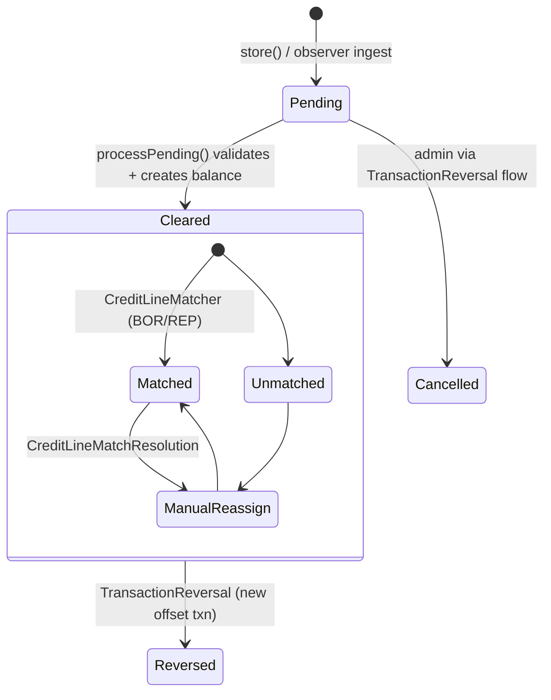

# MONEY SUBSYSTEM

The money subsystem covers how value enters and leaves the fund and how it is
allocated to beneficiaries. It groups three intertwined concerns: the
transaction ledger (the source of truth for shares + cash), credit lines (the
borrow-against-own-shares facility on top of that ledger), and the inbound
deposit pipeline (CSV today, webhook in the planned v1 of money-flow). This
doc is the memory-bank index for that subsystem — current, code-grounded
state with pointers to the design plans for the not-yet-shipped pieces.

> **Memory-bank doc** — see root [`AGENTS.md`](../AGENTS.md) for the index.
> **As of:** 2026-05-29. `path:line` references drift; verify with `git grep`
> before quoting in code review. Paths in this doc are relative to
> `app1/family-fund-app/` unless prefixed with `docs/`.

Companion docs:
[`Transactions.md`](Transactions.md) (transaction-type catalog + matching),
[`ACL_IMPLEMENTATION.md`](ACL_IMPLEMENTATION.md) (full permission matrix),
[`SECURITY.md`](SECURITY.md) (defense-in-depth overview),
[`credit_lines/credit_lines_plan.md`](credit_lines/credit_lines_plan.md)
(credit-line design, UC-* tracker),
[`credit_lines/fund_cashflow.md`](credit_lines/fund_cashflow.md) (Phase 0
receivable-as-asset decision),
[`credit_lines/matching_on_repayment.md`](credit_lines/matching_on_repayment.md),
[`money_flow_plan.md`](money_flow_plan.md) (BRL ↔ USD v1 design),
[`runbooks/money_flow_runbook.md`](runbooks/money_flow_runbook.md) (operator
runbook for the planned v1),
[`ENGINEERING_DECISIONS.md`](ENGINEERING_DECISIONS.md) (ED-0003 deny-by-default,
ED-0004 IDOR API scoping, ED-0015 admin-index scoping, ED-0016 admin-write
reference data).

---

## 1. Scope and bounded contexts

| Context | What it owns | Where the code lives |
|---|---|---|
| **Ledger** | Transactions (`PUR`/`SAL`/`INI`/`MAT`/`BOR`/`REP`), `AccountBalance` rows (`OWN`/`BOR` types), fund cash position. The single source of truth for share counts. | `app/Models/Transaction*`, `app/Models/AccountBalance*`, `app/Models/AccountExt.php` |
| **Credit lines** | A facility (`AccountCreditLine`) that groups paired `BOR`/`REP` transactions under a term + amortization schedule, with matching, adjustments, and reversals. | `app/Services/CreditLine/*`, `app/Models/AccountCreditLine*`, `app/Models/CreditLinePayment*` |
| **Detection** | Classifies inbound `PUR`/`REP` transactions and routes them (matching contributions, credit-line repayment matching). | `app/Services/Detection/*`, `app/Observers/TransactionObserver.php` |
| **Inbound deposits (today)** | IBKR Flex Query CSV → `CashDeposit` rows → manual or matched reconciliation with `DepositRequest`. | `app/Http/Controllers/Traits/CashDepositTrait.php`, `app/Jobs/FetchDeposits.php`, `app/Models/CashDeposit*`, `app/Models/DepositRequest*` |
| **Money flow (planned v1)** | BRL → Wise → US checking webhook → IBKR; outbound USD → BRL → PIX. Recipient registry, three-way reconciliation, isolated namespace. | **Design only** — `docs/money_flow_plan.md`; no `App\MoneyFlow` namespace yet. |

The ledger is fund-internal; money flow is the bridge to real-world cash. The
two are linked at one point: a `CashDeposit` ultimately produces a `PUR` or
`REP` transaction once attributed to a beneficiary.

---

## 2. Ledger entities

### 2.1 Transactions

`app/Models/Transaction.php` (Eloquent shape) +
`app/Models/TransactionExt.php` (all business logic). Every value flow in the
system is a row in `transactions`.

| Type | Const | Direction | Effect |
|---|---|---|---|
| Initial Value | `INI` | seed | Sets opening balance without share-price math. |
| Purchase | `PUR` | beneficiary buys shares | Decreases fund-available shares, increases account `OWN` balance. |
| Sale | `SAL` | beneficiary sells shares | Increases fund-available shares, decreases account `OWN` balance. |
| Matching | `MAT` | reward leg of a `PUR` | Generated by `createMatching()` against `AccountMatchingRule` ratios + caps. |
| Borrow | `BOR` | credit-line draw | Increases account `BOR` balance, decreases fund cash (cash leg booked via `addCashToFund` and the receivable model — see §3.5). |
| Repay | `REP` | credit-line repayment | Decreases account `BOR` balance, returns cash to the fund. |

Status (`status` column) cycles `P` Pending → `C` Cleared (or `S` Scheduled
for templates). `processPending()` at `TransactionExt.php:163` is the only
path that flips a `P` row to `C`; it validates against the latest balance
(`validateLatestBalance`) and balance overlap (`validateBalanceOverlap`) and
then creates the resulting `AccountBalance` row via `createBalance()`.

Flags (`flags` column, single char): `A` `FLAGS_ADD_CASH` (also push the
deposit into the portfolio's `CASH` asset), `C` `FLAGS_CASH_ADDED` (cash
already in the fund — share-value recalc excludes this deposit), `U`
`FLAGS_NO_MATCH` (suppress matching). The `A`/`C` distinction is the
hand-shake with the CSV ingestion path: `CashDepositTrait` stamps `C` when
the IBKR statement shows the wire was already received separately.

### 2.2 AccountBalance and the OWN/BOR split

Each account carries a stream of `AccountBalance` rows keyed by `(account_id,
type, timestamp)`. `type` is `OWN` (shares the account holder owns) or `BOR`
(shares borrowed against the account through an active credit line).
`AccountExt::allSharesAsOf()` (`AccountExt.php:97`) groups balances by type
as of a given timestamp; `sharesAsOf()` returns the **net** position `OWN −
BOR` (because borrowed shares aren't held).

> **Memory pin** — the goal "Current" number uses the *net* (`OWN − BOR`),
> not gross. The borrowed shares aren't yours to spend, so net is the one
> truthful figure. Two helpers exist for the rare gross-only read:
> `sharesWithoutBorrowingAsOf()` and `valueWithoutBorrowingAsOf()`
> (`AccountExt.php:141,150`).

### 2.3 Transaction lifecycle (state machine)



Transitions:

- **Store** writes status `P` and fires `TransactionObserver::saved`.
- **Ingest** — the observer calls `TransactionDetectionService::ingest()`
  (`app/Services/Detection/TransactionDetectionService.php:42`), which
  classifies (`ContributionClassifier`, `CreditLineClassifier`) and dispatches
  the credit-line matcher when applicable. The observer has a static
  reentrancy guard so matcher-side writes don't recurse.
- **Process** — `TransactionExt::processPending()` flips `P` → `C` and writes
  the `AccountBalance`. Triggered manually (`transactions.process_pending`,
  `transactions.process_all_pending`) or implicitly for system-generated rows.
- **Match status** — for `BOR`/`REP` rows, `transactions.credit_line_match_status`
  carries `auto_matched` / `manual` / `ambiguous` / `unmatched` (see §3.4 and
  `TransactionExt.php:42-45`). Ambiguous/unmatched rows are surfaced as a
  banner on the account page and resolved through
  `CreditLineMatchResolutionController`.
- **Reverse** — `TransactionReversal` (table + controller) writes a
  compensating row rather than deleting; see `app/Models/TransactionReversal.php`
  and `WebV1/TransactionReversalController`.

### 2.4 Cash on the fund side

The fund's cash position lives inside its portfolio (the `CASH` asset, not a
ledger column). `TransactionExt::addCashToFund()` (`TransactionExt.php:350`)
is the canonical writer. Two routes call it: a `PUR`/`SAL` carrying flag `A`
to add cash to the portfolio, and the cash-leg of a `BOR`/`REP`. See
`docs/credit_lines/fund_cashflow.md` for why a draw doesn't drop NAV
(receivable-as-asset).

---

## 3. Credit lines

Borrow shares against your own balance, pay them back over a chosen term, no
interest, no penalties. Implemented as a first-class facility on top of
`BOR`/`REP` transactions. The plan doc (`credit_lines_plan.md`) is the
design source; this section is the shipped surface.

### 3.1 Entities

| Model | Table | Role |
|---|---|---|
| `AccountCreditLine` / `AccountCreditLineExt` | `account_credit_lines` | One credit facility: principal_shares, outstanding_shares, term_months, payment_frequency, origination_date, maturity_date, status, notification settings, optional `imputed_interest_rate` (informational, for tax reporting). |
| `CreditLinePayment` | `credit_line_payments` | One scheduled (or executed) payment row in the amortization schedule. Generated up-front from the term + frequency; regenerated on adjustment. |
| `CreditLinePaymentAllocation` | `credit_line_payment_allocations` | Links a `REP` transaction to one or more schedule rows (a single payment may cover multiple rows when over-paying). |
| `CreditLineAdjustment` | `credit_line_adjustments` | Audit row for any term change; records the effective date and what the schedule looked like before. |
| `CreditLineDelayNotification` | `credit_line_delay_notifications` | De-dup record for late-payment emails (`UC-19`). |
| `AccountCreditLineBalance` | `account_credit_line_balances` | Per-line BOR balance trail (parallels `AccountBalance.OWN` for the line). |

Foreign keys: `transactions.account_credit_line_id` links `BOR`/`REP` rows
to the facility (`migrations/2026_05_13_000005_add_credit_line_columns_to_transactions.php`).

### 3.2 Status

`AccountCreditLineExt::STATUS_ACTIVE | STATUS_PAID_OFF | STATUS_CANCELLED`
(`AccountCreditLineExt.php:15-17`). There is intentionally no `defaulted`
status — late payments are informational, not penal (see
`credit_lines_plan.md` §7).

`CreditLinePayment::STATUS_SCHEDULED | STATUS_PAID | STATUS_PARTIAL |
STATUS_LATE | STATUS_CANCELLED` (`CreditLinePayment.php:26-30`).

### 3.3 Lifecycle

```mermaid
stateDiagram-v2
    [*] --> Active: DrawService::open()
    Active --> Active: RepayService::repay() (on-time / early / partial)
    Active --> Active: Adjust (term change → regenerate schedule)
    Active --> PaidOff: outstanding_shares == 0
    Active --> Cancelled: cancel (no outstanding) / reverse
    PaidOff --> [*]
    Cancelled --> [*]
```

- **Draw** — `app/Services/CreditLine/Draw/DrawService.php::open()`. Inside a
  DB transaction: locks the account row, validates `request_shares ≤ OWN −
  Σ outstanding`, creates the `AccountCreditLine`, writes the `BOR` transaction
  (linked via `account_credit_line_id`), generates the full
  `CreditLinePayment` schedule, and books the cash leg out of the fund. See
  `credit_lines_plan.md` §5 for the rules.
- **Repay** — `app/Services/CreditLine/Repay/RepayService.php::repay()` (or
  `repayRow()` for a specific schedule row). Creates a `REP` transaction
  linked to the line; `PaymentAllocator` writes one or more
  `CreditLinePaymentAllocation` rows that mark schedule rows
  `paid`/`partial`; `outstanding_shares` is recomputed. The class implements
  `Contracts\ScheduleAdvancer`, bound in `AppServiceProvider::register()` so
  the matcher can advance schedules without depending on `RepayService`
  directly (matching-layer / wave-1b decoupling).
- **Adjust** — `app/Services/CreditLine/Adjust/*` cancels remaining schedule
  rows, recomputes against current outstanding, writes a `CreditLineAdjustment`
  audit row.
- **Cancel** — `app/Services/CreditLine/Cancel/*`. Allowed only when no
  outstanding remains (lines fully repaid can be closed, draws can't be
  un-done — use Reverse instead).
- **Reverse** — `app/Services/CreditLine/Reverse/*` writes a compensating
  transaction (mirrors `TransactionReversal`).
- **Matching** — see §3.4.

### 3.4 Matching `REP` to a line

The matcher (`app/Services/CreditLine/Matching/CreditLineMatcher.php::match`)
runs from `TransactionDetectionService` for any `REP` and picks a target line
by priority:

1. Single active line on the account → assign, `auto_matched`.
2. `REP.shares == shares_due` of exactly one active line → assign.
3. (Optional, when `$cashFallbackEnabled`) cash value matches exactly one
   line.
4. `REP.shares == outstanding_shares` of one line → assign, line goes
   `paid_off`.

Outcomes write `credit_line_match_status` plus (when matched)
`account_credit_line_id`. `MatcherPersister` is the only writer; the
recursion guard on `TransactionObserver` stops the matcher's own writes from
re-entering. Ambiguous/unmatched rows surface as a banner on the account page
and are resolved through `WebV1/CreditLineMatchResolutionController`
(`MATCH_STATUS_MANUAL` after resolve).

> **Gotcha** — historic bug (now fixed): `MatchResult::noOp` once clobbered
> the `MANUAL` status back to `AUTO_MATCHED` on subsequent saves. The
> observer is now wired through `TransactionExt` rather than the base
> `Transaction` model so the path is exercised in tests.

### 3.5 Fund-side cash accounting

A draw moves cash *out* of the fund's `CASH` asset position with no
offsetting asset purchase. To keep NAV stable at the moment of draw, the
outstanding cash receivable is treated as a fund-level asset, valued at
`outstanding_shares × current_share_price`. The receivable drifts with the
share price over the life of the line — that drift is the fund's P&L on the
loan. Implementation is **derived, no new table** —
`FundExt::valueAsOf()` adds the receivable computed from active lines. Full
rationale + worked example: `docs/credit_lines/fund_cashflow.md`.

---

## 4. Inbound deposits (current vs planned)

### 4.1 What ships today: IBKR CSV pipeline

End-to-end:

1. `FetchDeposits` job (`app/Jobs/FetchDeposits.php`) pulls a CSV from
   Interactive Brokers' Flex Query API using `TradePortfolio.tws_query_id /
   tws_token`. Runs on demand — **not on the scheduler**
   (see `docs/ARCHITECTURE.md` §6.3; the legacy `Kernel::schedule()` entry is
   dead under the Laravel-11 minimal bootstrap).
2. `CashDepositTrait::parseCashDeposit()`
   (`app/Http/Controllers/Traits/CashDepositTrait.php:76-191`) parses the CSV
   columns (`ClientAccountID`, `Description`, `SettleDate`, `Amount`,
   `TransactionID`, `ClientReference`) and writes `CashDeposit` rows.
3. Operator reconciles via the cash-deposit UI (`/cashDeposits/{id}/assign`)
   → match a `CashDeposit` to a `DepositRequest` and book the resulting
   transaction. `WebV1/CashDepositControllerExt::assign` / `doAssign`.

`CashDepositExt::STATUS_PENDING → DEPOSITED → ALLOCATED → COMPLETED`
(`CashDepositExt.php:7-11`), with `CANCELLED` as the off-ramp.

The pipeline already recognizes "FROM WISE INC" entries in test data; the
`FLAGS_CASH_ADDED` ('C') flag is stamped on the resulting transaction so the
fund-cash recalc doesn't double-count the deposit.

### 4.2 What is *planned*, not built

`docs/money_flow_plan.md` describes a different, end-to-end design:

- US business checking sidecar with a developer-API bank (Mercury/Relay) as
  the orchestration hub.
- Webhook ingestion at the checking account (Wise → USD ACH → checking),
  attribution at the webhook instant.
- Brazilian recipient registry, outbound USD → BRL → PIX.
- Isolated `App\MoneyFlow` namespace, its own queue, audit log
  (`mf_audit_log`), three-way reconciliation report.
- Webhook signature validation, idempotency keys, OFAC screening.

**None of those models exist in `app/Models/` yet** — neither
`CheckingDeposit` nor `BrazilianRecipient` nor `mf_audit_log`. The runbook
(`docs/runbooks/money_flow_runbook.md`) describes the operator surface for
that planned v1, not the surface available today. Future operators chasing
those models in code should expect to land in the design docs, not in
`app/Models/`. (Already flagged in
[`docs/OPERATIONS.md`](OPERATIONS.md) §1.)

---

## 5. ACL enforcement points

The full role/permission matrix lives in
[`ACL_IMPLEMENTATION.md`](ACL_IMPLEMENTATION.md). This section catalogues
*where* the money subsystem enforces it — defense-in-depth per
[`SECURITY.md`](SECURITY.md) §2.2 and ED-0003.

### 5.1 Four layers, deny by default

1. **Route middleware.** Every business route is under `auth` (web) or
   `auth:sanctum` (api). The money/management surface additionally requires
   `fund.full` (`RequireFullFundAccess`,
   `app/Http/Middleware/RequireFullFundAccess.php`) — a wave-of-blanket gate
   on the generated CRUD admin pages (ED-0015). Examples in
   `routes/web.php:130-204` cover funds, accounts, transactions,
   credit-lines, cash deposits, deposit requests.
2. **Policies.** `AccountPolicy`, `FundPolicy`, `TransactionPolicy`,
   `AccountCreditLinePolicy` (`app/Policies/`). Each `before()` short-circuits
   `true` for `User::isSystemAdmin()` and returns `null` otherwise. Every
   CRUD verb in `WebV1/AccountControllerExt`,
   `WebV1/TransactionControllerExt`, `WebV1/FundControllerExt`,
   `WebV1/AccountCreditLineController`, and
   `WebV1/CreditLineMatchResolutionController` calls
   `$this->authorize($ability, $modelOrClass)`.
3. **Query scoping.** `app/Services/AuthorizationService.php` provides
   `scopeAccountsQuery`, `scopeTransactionsQuery`, `scopeFundsQuery`,
   `scopeCreditLinesQuery` and `getAccessibleFundIds()`. Repositories opt in
   via the `AuthorizesQueries` trait (`app/Repositories/Traits/`) and the
   `withAuthorization()` chain. **Deny-by-default**: a user with neither
   full-fund access nor own-accounts gets `whereRaw('1 = 0')` rather than an
   empty filter — fixed after the `#74` scope leak where an empty closure
   returned all rows.
4. **API model layer.** `AuthorizesApiAccess` trait (ED-0004) applies
   object-level scoping on every `APIv1` mutation. Reference-data writes
   (`assets`, `asset_prices`, `matching_rules`, `schedules`,
   `change_logs`, `asset_change_logs`, `exchange_holidays`) are
   system-admin-only behind the `familyfund.enforce_admin_writes` flag
   (ED-0016).

### 5.2 Subsystem-specific access rules

| Surface | Beneficiary | Financial Manager | Fund Admin |
|---|---|---|---|
| Transactions index (`transactions.*`) | no (own is reachable via the account page) | yes, fund-scoped | yes, fund-scoped |
| Transactions create / process | no | yes | yes |
| Credit-line index (`accounts/{id}/credit-lines`) | yes, own account only | yes, fund-scoped | yes, fund-scoped |
| Credit-line draw / adjust | no | yes | yes |
| Credit-line repay | yes, own line | yes | yes |
| Credit-line cancel | no | no | yes |
| Match resolution (banner → form) | yes, own | yes, fund-scoped | yes |
| Cash deposits (`cashDeposits.*`) | no | yes | yes |
| Reference-data writes (`POST /api/asset_prices_bulk_update`, etc.) | no | no | no — **system-admin only** (ED-0016) |

> **Gotcha — beneficiary leak via NAV.** The beneficiary dashboard once
> computed fund NAV via a tier-blind path that effectively re-exposed
> portfolio composition to beneficiaries; fixed in the role-tiering sweep.
> Lesson: role tiering must precede any mass role-grant. The fund show/index
> pages have per-role `@can` gating on action icons + the "New Fund" button
> — don't re-introduce admin icons in a shared partial.

> **Gotcha — fund-show test pricing.** When asserting credit-line numbers on
> the fund-show page in tests, price a non-`CASH` asset.
> `FundExt::calculateDataStaleness` ignores `CASH`, so a seeded `CASH`-only
> portfolio reports stale prices and the staleness banner pre-empts the
> rendering you're asserting on.

### 5.3 The dev-only `/dev-login` impersonation surface

`routes/web.php:21` gates `/dev-login/{redirect?}` to `local|dev|testing`.
The `RedirectStrayImpersonation` middleware funnels stray `?as=` requests
through the dev-login route so an admin clicking an impersonation link in
prod gets redirected rather than silently switching identity. `?as=admin`
resolves to `ADMIN_EMAILS[0]` (config `familyfund.admin_emails`) — not a
hardcoded email.

---

## 6. Cross-cutting gotchas

- **Goal "Current" is net of borrowing.** `OWN − BOR`, not `OWN`. Borrowed
  shares aren't held, so net is the truthful figure. The two
  `*WithoutBorrowing*` helpers exist for rare gross reads only.
- **`account_credit_line_id` is nullable on `transactions`.** One-off
  `BOR`/`REP` rows without a facility remain valid. Don't `whereNotNull`
  blindly in new queries.
- **Observer wiring is on `TransactionExt`, not `Transaction`.** Repositories
  that `new Transaction()` instead of `new TransactionExt()` skip detection
  + matching. Fixed for the known offenders; re-check when adding a new
  write path.
- **Per-line vs per-account BOR balance.** `account_balances.type='BOR'`
  is the *account-level* aggregate across all active lines.
  `account_credit_line_balances` keeps the per-line trail. Both are
  written; readers pick the right grain.
- **Fund cash never drops at draw.** The receivable-as-asset model keeps NAV
  stable at the moment of draw. Tests that assert "fund cash dropped" by
  inspecting `CASH` alone will fail to see the offsetting receivable; assert
  on `FundExt::valueAsOf()` instead. From `docs/credit_lines/fund_cashflow.md`.
- **Reference-data writes need a system-admin Sanctum token.**
  `dstrader` holds it; rotation runbook at
  [`runbooks/ff-service-token-rotation.md`](runbooks/ff-service-token-rotation.md).
- **Money-flow runbook describes work that doesn't exist yet.** Its
  `CheckingDeposit` / `BrazilianRecipient` / `mf_audit_log` references are
  forward pointers to `money_flow_plan.md` v1, not live models.
- **`FetchDeposits` is not scheduled.** Inbound CSV ingest is on-demand only
  today; the legacy `Kernel::schedule()` entry is dead under Laravel-11's
  minimal bootstrap (see `docs/ARCHITECTURE.md` §6.3).

---

## 7. Out of scope for this doc

- Full permission matrix → [`ACL_IMPLEMENTATION.md`](ACL_IMPLEMENTATION.md).
- Per-transaction-type diagrams (cash-position math, matching ratios) →
  [`Transactions.md`](Transactions.md) + `app1/family-fund-app/docs/FAMILYFUND_TRANSACTION_SYSTEM.md`.
- BRL ↔ USD design + operator runbook → [`money_flow_plan.md`](money_flow_plan.md)
  and [`runbooks/money_flow_runbook.md`](runbooks/money_flow_runbook.md).
- Credit-line UC-* tracker + adjustment math → [`credit_lines/credit_lines_plan.md`](credit_lines/credit_lines_plan.md).
- Per-decision history → [`ENGINEERING_DECISIONS.md`](ENGINEERING_DECISIONS.md).
- Operator runbooks (deploy, reseed, rotation) → [`OPERATIONS.md`](OPERATIONS.md).
