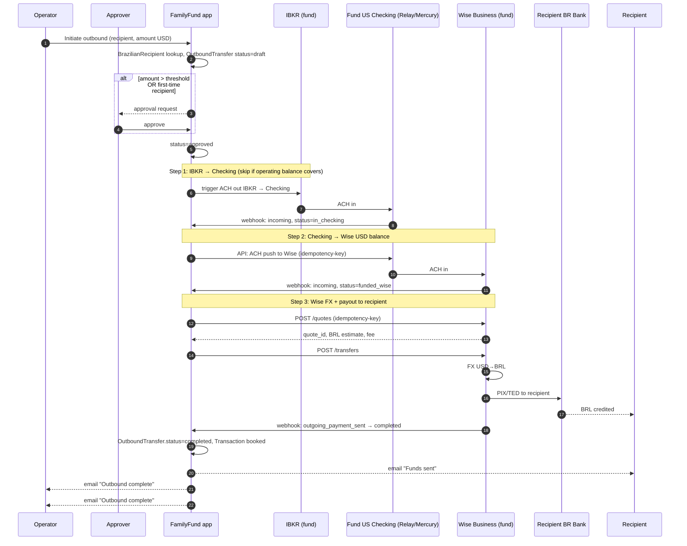
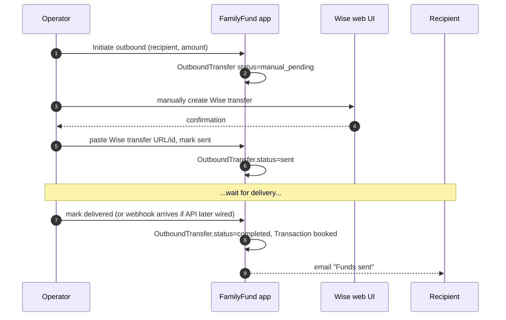

# Money Flow — Brazil ↔ US Fund — Planning Document

**Status:** Draft / sub-project proposal — not yet scoped for implementation
**Last Updated:** 2026-05-13 (rev 6 — folded accepted items from plan_recommendations.md: USD-only booking, pending-attribution state, CashDeposit coexistence plan, line-item reconciliation, RBAC matrix, PII email policy, 1-year idempotency, closure-block extended)
**Branch:** `claude/plan-credit-lines-cCjWG`
**Related docs:** [`Transactions.md`](Transactions.md), [`app1/family-fund-app/docs/FAMILYFUND_TRANSACTION_SYSTEM.md`](app1/family-fund-app/docs/FAMILYFUND_TRANSACTION_SYSTEM.md), [`credit_lines_plan.md`](credit_lines_plan.md), [`testing_plan.md`](testing_plan.md) — every MF-* below is mapped to a named test in `testing_plan.md` §4.2 (inbound) and §4.3 (outbound).

---

## 1. Goal

Design an end-to-end money-flow subsystem so that:

1. **Inbound** — a beneficiary in Brazil can pay BRL from their Brazilian bank (PIX or otherwise), have it converted and routed to the fund's USD bank/broker account, and have the system **automatically detect** the arrival, attribute it to the beneficiary, and book the right `CashDeposit` / `Transaction` (likely a credit-line `REP` per `credit_lines_plan.md`).
2. **Outbound** — the fund can automatically (or semi-automatically) send USD/BRL to a beneficiary's Brazilian bank account (PIX or Wise transfer) when they take a credit-line draw or a withdrawal.
3. **Registry** — the system stores Brazilian recipient information (PIX keys, bank/agency/account, CPF) so outbound transfers can be initiated programmatically.
4. **Isolation** — the entire money-flow subsystem lives in its own namespace, has its own queue, its own audit log, and stricter access controls than the rest of the app.

This document is a starting point. It maps the existing infrastructure, proposes options ranked by complexity, and lists what still needs decisions before implementation.

---

## 1.5 v1 scope (read this first)

To keep the first version tractable, **v1 ships exactly one inbound path and one outbound path**, and everything else in this doc is reference for later phases.

**v1 inbound** — the only path we build first:

```
Beneficiary's own Wise account
   │ ACH USD
   ▼
Fund US checking (trust-owned, Relay or Mercury, with developer API)
   │ webhook fires on arrival
   │
   │  ── ATTRIBUTION HAPPENS HERE, IMMEDIATELY ──
   │      • CheckingDeposit row created
   │      • matched to a pre-registered DepositRequest by amount + window
   │      • beneficiary's shares credited
   │      • fund's unallocated cash credited
   │      • notification email sent
   │
   ▼ (later, operator-triggered)
ACH push checking → IBKR (for investment, on trader's schedule)
```

**v1 outbound** — disburse against existing fund cash:

```
Operator initiates outbound
   │ approval if needed
   ▼
Books debited immediately (beneficiary shares ↓, fund unallocated cash ↓)
   │ blocks if checking cash < amount — does not auto-sell
   ▼
ACH checking → Wise → BRL → PIX to recipient
```

**The buffer principle that makes this work.** Attribution and bookkeeping happen as soon as the deposit is *recognized* at the checking webhook, in seconds. The physical money may take 1–3 business days to actually arrive at IBKR (for inbound) or at the recipient's BR bank (for outbound). The books don't wait. Instead, we maintain explicit **cash buffers** at each account so the system stays consistent without forcing premature trades:

| Buffer | Purpose |
|---|---|
| Checking operating balance (floor / ceiling) | Covers outbound disbursements without needing same-day IBKR funding. When low, operator (or trader) sweeps cash from IBKR. When high, sweeps to IBKR. |
| IBKR cash position | Covers normal portfolio activity. The trader chooses how much to leave as cash vs. invested. |
| (Implicit) timing buffer between attribution and physical settlement | The 0–3 day gap between webhook receipt and IBKR cash arrival doesn't block anything because the fund's books already reflect the deposit on the unallocated-cash line. |

**Explicitly deferred for v1** (kept in this doc for reference):

| Feature | Where it's discussed | When |
|---|---|---|
| Fund-owned Wise Business account with PIX webhook (Path B inbound) | §4.2, §8.2 | v2 — when CPF-level attribution becomes worth the integration cost |
| Direct PIX via Brazilian fintech partner (Path C inbound + outbound) | §4.3, §5.3 | v3+ — requires fund CNPJ, BR banking relationship, legal/compliance work |
| OFAC / sanctions screening, per-recipient limits | §11 risks, §10 MF-19/20 | After legal review |
| Automated state-machine reversals across all stages | §5.5 | v2 — v1 reversals are operator-driven via the audit log |

The full vendor evaluation (§3.6), recipient registry (§6), subsystem isolation (§7), and reconciliation reports (§4.4 three-way) all stay in v1 because they apply to the v1 path. The deferred items above are the elaborations that add value once v1 is running.

**Operational counterpart.** Day-to-day operation of the v1 system is documented in the companion [`money_flow_runbook.md`](money_flow_runbook.md) — daily / weekly / monthly task lists plus incident playbooks.

---

## 2. What already exists

The codebase has a working CSV-driven inbound pipeline. Key pieces:

| Component | Location | What it does |
|---|---|---|
| `CashDeposit` / `CashDepositExt` | `app/Models/` | Records an incoming cash deposit at the fund's broker (IBKR). Status flow: `PENDING` → `DEPOSITED` → `ALLOCATED` → `COMPLETED`. |
| `DepositRequest` / `DepositRequestExt` | `app/Models/` | Beneficiary's request to deposit money into the fund — pairs with a `CashDeposit` when reconciled. |
| `CashDepositTrait::parseCashDeposit()` | `app/Http/Controllers/Traits/CashDepositTrait.php:76-191` | Parses an Interactive Brokers Flex Query CSV (cols: `ClientAccountID`, `Description`, `SettleDate`, `Amount`, `TransactionID`, `ClientReference`) and creates `CashDeposit` rows. Already recognizes "FROM WISE INC" entries in test data. |
| `FetchDeposits` job | `app/Jobs/FetchDeposits.php` | Pulls deposits from IBKR per `TradePortfolio.tws_query_id` / `tws_token`, parses, and emails confirmation / errors. Not currently scheduled — runs on demand. |
| Cash-deposit UI | `routes/web.php` | `GET/POST /cashDeposits/{id}/assign`, `tradePortfolios/{id}/preview_deposits`, `do_deposits` — manual reconciliation UI. |
| `TransactionExt::FLAGS_CASH_ADDED = 'C'` | `app/Models/TransactionExt.php:39` | Flag used when cash was already in the fund (wire received) — share-value recalc excludes that deposit. Used by `CashDepositTrait.php:155`. |
| `TransactionExt::FLAGS_ADD_CASH = 'A'` | `app/Models/TransactionExt.php:38` | Flag used when the deposit also adds cash to the portfolio's CASH asset. |
| `TransactionMatching` + `MatchingRule` | `app/Models/` | The matching subsystem (parental contributions) — relevant because the same primitives will route detected deposits to credit-line REPs (see `credit_lines_plan.md` §10). |
| Existing docs | `Transactions.md`, `docs/FAMILYFUND_TRANSACTION_SYSTEM.md` | Describe transaction types, flags, and cash-position math. |

**What is NOT in place:**
- No multi-currency support — every amount is treated as USD; `FXRateToBase = 1` everywhere in tests.
- No registry of external bank accounts or recipients.
- No outbound payment integration of any kind.
- No webhook receiver; everything is poll-based.
- No `FetchDeposits` schedule — the job exists but doesn't run automatically.
- No Brazilian-payment-specific code (no PIX, no BRL, no CPF validation).

---

## 3. Design assumptions and constraints

| Constraint | Implication |
|---|---|
| Fund's brokerage is at **Interactive Brokers (US)**, holding USD. | All inbound BRL must convert to USD before arriving. All outbound to BR must convert USD → BRL. |
| Fund **also holds a US business checking account** at a bank with a developer API (Mercury / Relay / Brex / Column — see §3.5). This is the **cash orchestration hub** between FX and brokerage. | Detection, attribution, and outbound disbursement all anchor on this account, not on IBKR directly. |
| FamilyFund app stack is Laravel 11 on Docker; deployed on a single private server. | No serverless edge functions; webhook receivers must be exposed via the Laravel app. |
| Outgoing-money operations are **high-stakes and infrequent**. | Optimize for safety (idempotency, approval flows, audit), not throughput. |
| The system is family-scale, not commercial. | A single bank/fintech partner per direction is fine. No need for a routing engine. |
| Brazilian financial regulation (Banco Central) and US compliance (OFAC, FinCEN) are **non-negotiable**. | Out of scope for this doc to design, but the proposal must leave room for KYC, transaction reporting, and per-recipient limits. Flag for legal review before any live deployment. |
| The money-flow subsystem **never trades securities**. | Outbound draws against existing fund cash only. If insufficient, it blocks and notifies the trader. See §5.0. |
| **No FX rate is tracked on our side** (rev 6 — per MF-R2). | The system books only the final USD amount that arrives at the checking account. BRL→USD conversion is upstream of our books (Wise's responsibility). `CheckingDeposit.amount` is the USD; beneficiary's share credit is computed from that × current share price. Borrowers can see the BRL→USD detail in their own Wise app; FamilyFund shows what actually arrived. Path B's `WiseTransfer.fx_rate` (if/when added) is informational only. |

### 3.5 Fund banking topology — three-account model

Money does not flow from Wise straight into IBKR. It passes through a **fund-owned US business checking account** that acts as the cash hub. This is the architectural change in rev 3:

```
┌─────────────────────────┐   ┌─────────────────────────────┐   ┌────────────────────┐
│  Wise (BR ↔ US rails)   │ ↔ │  US business checking       │ ↔ │  IBKR (investments)│
│  - PIX in / out         │   │  (Mercury / Relay / Brex)   │   │  - USD cash        │
│  - FX BRL ↔ USD         │   │  - API + webhooks           │   │  - portfolio       │
└─────────────────────────┘   │  - originator-rich inbound  │   └────────────────────┘
                              │  - ACH out to IBKR & others │
                              └─────────────────────────────┘
                                          ▲
                                          │
                                   Detection & attribution
                                   happen here (real-time webhooks)
```

**Why three accounts and not two:**

1. **API quality.** IBKR's Flex Query is a polled CSV with stripped originator data (§4.5.1). A modern business-bank API (Mercury, Relay, etc.) gives real-time webhooks with full ACH/wire originator name, memo, trace fields, and balance updates. Detection becomes seconds, not minutes; attribution gets the data IBKR drops.
2. **Separation of concerns.** Cash orchestration (receive → hold → invest) is conceptually different from investment custody. Mixing them at IBKR makes credit-line draws and disbursements clumsy.
3. **Outbound automation.** ACH push from a Mercury/Relay account is one API call. Same outbound from IBKR is harder and more error-prone.
4. **Audit boundary.** Every dollar passes through one accountable, queryable, API-introspected account before reaching the brokerage. Reconciliation becomes a tight three-way check: Wise ↔ Mercury ↔ IBKR.
5. **Operator UX.** When attribution fails, the operator can intervene on the checking account (with a human-readable transaction list and originator info) before the money is "trapped" inside IBKR's custodial flow.

**The accounts and their roles:**

| Account | Role | Holds | API |
|---|---|---|---|
| Wise (personal or Business — see §3.6) | FX + BR rails | BRL / USD short-term | Yes (Wise Business API) |
| **Fund US checking (Mercury / Relay / Brex / Column)** | **Cash hub, ledger of record for unallocated USD** | **USD** | **Yes (rich webhooks) — the focus of this rev** |
| Interactive Brokers | Investment custody | USD cash + portfolio assets | Flex Query (polled CSV) |

### 3.6 Banking vendor evaluation for the US checking hub

ChatGPT suggested Mercury. Here are the realistic options with the trade-offs for this use case.

| Vendor | API quality | Multi-user / roles | KYB for family LLC / trust | Free tier | Notes |
|---|---|---|---|---|---|
| **Mercury** | Strong; well-documented, webhooks for incoming + outgoing transfers, statements API. | Yes; admin/bookkeeper/custom roles. | Historically picky — accepts US LLCs and some C-corps; family trusts and foreign-owned entities have been rejected in the past. Mercury has tightened KYB significantly since 2024. **Confirm onboarding eligibility first.** | Yes | The default suggestion. Strong DX. |
| **Relay** | Good API, webhooks, role-based permissions designed for SMB operating accounts. **Native multi-user with granular permissions** maps cleanly to our `money_flow_operator` / `money_flow_approver` split. | **Best in class for this** — built around team banking with approval workflows. | More accommodating of small entities than Mercury. Still requires a US-registered business. | Yes | Strong alternative; arguably better fit for an approval-gated outbound model since approvals are a first-class feature. |
| **Brex Cash** | API exists; mostly aimed at funded startups. | Yes. | Restrictive — startups / funded businesses are the target. Family fund likely doesn't qualify. | Yes for qualifying customers | Likely not the right fit. |
| **Column** | Most flexible — bank-as-a-service with direct Fed access. ACH, wire, real-time payments all as primitives. Webhooks for every event. | Programmable; you build your own permissions. | Requires a treasury/ops engineering investment. | No free tier; usage-based. | Best technical fit but the heaviest lift. Worth considering only if the integration is expected to grow into a real payments product. |
| **Plaid (fallback)** | Read-only across most US banks. No outbound. | N/A | N/A | Yes (limited) | Not a bank — a connectivity layer. If we end up at a traditional bank without its own API, Plaid covers detection. Doesn't help outbound. |
| **Modern Treasury / Increase** | Treasury automation over multiple banks (MT) or a bank itself (Increase). | Yes. | Varies. | No | Overkill for v1 family scale. |

**Recommendation.** **Relay first, Mercury second.** Relay's built-in approval workflows mirror the §7.5 authorization model exactly — every outbound transfer can require a second approver natively at the bank level, providing defense-in-depth on top of FamilyFund's own approval flow. Mercury is a perfectly acceptable fallback if KYB at Relay doesn't work out for the entity type.

Either way, the FamilyFund integration is bank-agnostic at the seam: define an abstract `BankingApiClient` interface and have `MercuryClient` / `RelayClient` / etc. as concrete implementations. The rest of the money-flow code never names the vendor.

---

## 4. End-to-end flow — inbound (Brazil → Fund)

The realistic ways money gets from a beneficiary's BR bank into the fund's IBKR USD account:

### 4.1 Path A — Wise personal transfer (v1, lowest complexity) ✅ recommended for v1

Beneficiary does a Wise transfer themselves; money lands in the **fund's US checking account** (Mercury/Relay/Brex/Column — see §3.6); we detect via the checking-account webhook in near-real time; a scheduled ACH push moves matched funds from checking to IBKR for investment.

```
[Beneficiary BR bank]
       │ PIX or TED in BRL
       ▼
[Beneficiary's own Wise account]
       │ FX BRL→USD (Wise mid-market + fee)
       ▼
[Wise → fund US checking via ACH]
       │ (Mercury / Relay routing & account #)
       ▼
[Fund US checking — Mercury/Relay]
       │ webhook: incoming ACH, originator="WISE US INC", amount, memo, trace id
       ▼
[Webhook receiver in App\MoneyFlow]
       │ idempotent CheckingDeposit row, status=received
       │ matcher runs: amount + window + open DepositRequest (§4.5)
       ▼
[CashDeposit attributed to beneficiary]
       │ scheduled "sweep to IBKR" job (operator-configured threshold / cadence)
       ▼
[ACH push from checking → IBKR — via banking API]
       │ FetchDeposits reconciles the IBKR side later (CSV continues working)
       ▼
[IBKR USD cash position]  ──▶ credit-line auto-matcher (§5 below) or DepositRequest assignment UI
```

**What we build:**
- A `BankingApiClient` abstraction with concrete `MercuryClient` / `RelayClient` (or whichever vendor wins §3.6). All vendor specifics live behind this seam.
- A webhook receiver: `POST /money-flow/checking/webhook` with HMAC signature verification.
- A `CheckingDeposit` model (analogous to `WiseTransfer` in old §4.2): id, banking_provider, provider_transaction_id, originator_name, originator_routing, amount_usd, memo, trace_id, raw_payload (encrypted JSON), status, attached_cash_deposit_id (nullable, set when reconciled with IBKR).
- An ACH-push service that drains the checking account to IBKR (manual approval for v1, scheduled sweep for v2).
- Schedule the existing `FetchDeposits` job at 30-min cadence — still useful as the IBKR-side reconciler, even though detection has shifted upstream.
- Auto-match to credit-line `REP`s via the `TransactionDetectionService` from `credit_lines_plan.md` §10.

**What's required from the beneficiary:**
- Beneficiary registers their Wise account in `BrazilianRecipient` (one time).
- Beneficiary pre-registers each transfer via `DepositRequest` (§4.5.1 still applies — Wise→Mercury via ACH carries originator "WISE US INC", not the BR beneficiary's name; pre-registration remains the primary attribution anchor).

**Why this is v1:** the checking account is the *only* new account we need to open. The beneficiary still uses their existing personal Wise. The attribution problem from old rev 2 §4.5.1 is unchanged structurally — Wise's ACH-out doesn't expose the upstream PIX originator — but the detection latency drops from 30 min (CSV poll) to seconds (webhook), and the attribution UX moves to a richer surface (the checking account's transaction list, not the IBKR Flex Query).

### 4.2 Path B — Fund-owned Wise Business + checking hub (v2, full automation)

> **Deferred for v1** (see §1.5). v1 ships Path A only. This section stays in the doc as the v2 design — revisit when CPF-level attribution becomes worth the Wise Business integration cost.

The fund holds a **Wise Business account in its own name** (alongside the US checking account). The BR beneficiary sends PIX directly to the fund's Wise Business BRL receiving address. Wise webhook fires with **full PIX-originator data** (CPF, sender name, bank). Wise then auto-converts BRL→USD and forwards to the fund's US checking. The checking account's webhook fires when the USD lands.

```
[Beneficiary BR bank]
       │ PIX in BRL with reference code R
       ▼
[Fund's Wise Business — BRL receiving]
       │ webhook to App\MoneyFlow with rich sender block:
       │   sender.profile.id, sender.name, sender.cpf,
       │   sender.bankCode, sender.pixKey, transfer.reference=R
       ▼
[App\MoneyFlow: WiseTransfer row created, sender block stored encrypted]
       │ auto-match against BrazilianRecipient.wise_sender_profile_id / .document_number_hash
       │ → attribution decided HERE, at the rich Wise data
       ▼
[Wise auto-FX BRL→USD per pre-set rule]
       │
       ▼
[Wise USD → fund US checking via ACH]
       │ checking webhook: incoming ACH "FROM WISE US INC" amount=USD
       ▼
[App\MoneyFlow: CheckingDeposit row, reconciled with WiseTransfer via amount + date proximity]
       │ scheduled sweep
       ▼
[ACH push from checking → IBKR]
       │ FetchDeposits reconciles the IBKR side
       ▼
[IBKR USD cash position]  ──▶ credit-line auto-matcher (§5 below) — already attributed
```

**What we build (additional to Path A):**
- A Wise Business API client (rate-limited, idempotent, signed).
- A webhook receiver: `POST /money-flow/wise/webhook` with signature verification.
- A `WiseTransfer` model: id, direction, amount_brl, amount_usd, fx_rate, wise_id, status (`received` / `converting` / `paid_out` / `failed`), sender block (encrypted JSON), webhook payload (encrypted JSON), attached_checking_deposit_id (nullable).
- Three-way reconciliation: `WiseTransfer` (BR PIX side) ↔ `CheckingDeposit` (US checking side) ↔ `CashDeposit` (IBKR side). Daily reconciliation job verifies all three legs match.
- Attribution moves *up* the chain to the Wise step, where CPF and sender profile id are available (§4.5.2 logic).

**The big win of Path B with the three-account topology:** attribution happens **at the earliest possible point** (Wise webhook with PIX data), and money moves cleanly through the cash hub for orchestration before reaching investments. The IBKR side becomes a downstream consumer that just receives "this much, sweep happened on X date" — no attribution logic there at all.

### 4.3 Path C — Brazilian fintech partner (v3, native PIX)

> **Deferred for v1** (see §1.5). Requires the fund to hold a Brazilian bank account under a CNPJ — significant legal/compliance work that doesn't pay off until volume justifies it.

Most aggressive: a Brazilian fintech (BS2, Stark Bank, Inter, or Wise's own BR licence) gives us a fund-owned BR account that receives PIX directly. Their API notifies us on each PIX. The partner converts BRL → USD and remits to IBKR.

**Why this is v3:** requires the fund to be legally registered to hold a BR account (CNPJ or equivalent), a banking relationship with a BR fintech, and KYC/compliance work. Significant before-you-code work; out of scope for v1.

### 4.4 Detection mechanism summary

The detection seam is **`TransactionDetectionService::ingest($transaction)`** from `credit_lines_plan.md` §10.2. With the three-account topology (§3.5), money-flow inbound feeds it via three parallel streams, each landing at a different point in the chain:

| Source | Trigger | Creates | When this fires |
|---|---|---|---|
| **Fund US checking webhook** (Mercury / Relay / ...) | `POST /money-flow/checking/webhook` | `CheckingDeposit` row | First detection point for Path A. Second detection point for Path B (after Wise FX). |
| Wise webhook (Path B/C) | `POST /money-flow/wise/webhook` | `WiseTransfer` row, with rich BR-origin sender block | First detection point for Path B. Best attribution data — happens **before** the funds reach the checking account. |
| IBKR Flex Query | `FetchDeposits` job on a 30-min schedule | `CashDeposit` row | Last detection point — used now as a **reconciliation backstop** rather than primary detection. Confirms that swept funds actually arrived at the broker. |

Each detected event flows through:

```
[CheckingDeposit OR WiseTransfer] → attribute (DepositRequest / BrazilianRecipient) →
   sweep to IBKR (next scheduled push) → CashDeposit (IBKR reconcile) →
   CreditLineMatcher / DepositRequest match → Transaction → §8.6 transaction emails
```

**Daily reconciliation** (a new job) runs at two levels:

1. **Balance reconciliation** — sum of `WiseTransfer` outgoing-to-checking ↔ sum of `CheckingDeposit` from-Wise ↔ sum of `CashDeposit` from-checking, all over the same window. Any leg that doesn't match raises an alert.
2. **Line-item reconciliation** (rev 6 — per MF-R9) — every `CheckingDeposit` row must have a corresponding bank-statement line; every `OutboundTransfer` step (checking-debit, Wise-credit, etc.) has matching debits at each hop. Unmatched line items raise alerts — not just balance gaps. This catches the case where a missing $50 deposit is hidden by an extra $50 elsewhere, which balance-only reconciliation would miss.

### 4.5 Attribution: how we know which beneficiary sent it

**Detection** (a deposit arrived) is the easy part. **Attribution** (whose deposit is it?) is where the two paths diverge sharply. The shape of the data each path gives us decides what we can register and what we can match on.

#### 4.5.1 Path A attribution — at the US checking hub (revised in rev 3)

In rev 3, detection moves upstream from IBKR's CSV to the checking-account webhook. This is a meaningful upgrade *for some attribution fields*, but **not for the fundamental Wise-strips-the-originator problem**.

**What the checking webhook gives us** (Mercury / Relay / Brex payloads share a similar shape; the exact field names will be normalized behind the `BankingApiClient` abstraction):

| Field | What it carries | Better than IBKR? |
|---|---|---|
| `transactionId` | Bank's globally-unique id. | Equivalent. |
| `originatorName` | "WISE US INC" or the Wise legal entity used for the ACH. **Still Wise, not the beneficiary.** | Equivalent — but populated reliably (banking APIs surface ACH originator name; IBKR's CSV often doesn't). |
| `originatorRouting` / `originatorAccount` | Wise's routing + the last 4 of their ACH account. Distinguishes Wise vs other senders. | Better than IBKR's "from somewhere" — we can confidently say "this came via Wise" vs "this came via a domestic friend's ACH". |
| `companyEntryDescription` / `memo` / `addenda` | Free-text. **Wise's behavior here is the key question** — see §11 open Q9 (was IBKR-specific; now applies to the checking hub). | Likely better preserved than at IBKR, but still vendor-dependent. |
| `effectiveDate` / `postedAt` | When the ACH cleared. | Equivalent. |
| `amount` | USD. | Equivalent. |
| `traceNumber` | ACH trace id — useful for reconciliation with Wise's own outbound record. | New. Lets us do three-way reconciliation §4.4. |
| `availableBalance` | Running balance on the checking account. | New. Lets the system display the fund's cash position in real time. |

**Bottom line:** when money arrives via Path A, the **checking-account record** looks like:

```
"$1000 ACH credit from WISE US INC on 2026-05-10, trace 021000021xxxxxxx, memo=(maybe useful)"
```

Compared to IBKR's view ("from Wise"), we now have: (a) confirmation it's Wise specifically (vs some other sender), (b) the ACH trace id for reconciliation, (c) seconds-latency detection via webhook, (d) likely-better-preserved memo field. But the **upstream BR beneficiary's name and CPF are still not present** — Wise's ACH-out from its USD pool to our checking carries Wise as originator, not the underlying PIX sender. That information lives in *Wise's* system and is only retrievable via Path B (a fund-owned Wise Business account with webhook access).

**Handling deposits without a matching DepositRequest** (rev 6 — per MF-R4). A deposit can arrive without a pre-registered `DepositRequest` (beneficiary forgot, one-off transfer, first-time deposit). In that case:

1. The `CheckingDeposit` row is created with `attribution_status = pending` (new enum column, default `attributed` when the matcher finds a unique `DepositRequest`, otherwise `pending`).
2. The deposit appears on the operator dashboard with the sender description, amount, date, raw bank payload.
3. The operator manually assigns it to a beneficiary's account. The beneficiary's shares are credited at that point.
4. Recipient-registry auto-creation on assign is **not** in v1 — operator can still create the `BrazilianRecipient` row as a separate step if they want subsequent transfers to auto-attribute.
5. No escalation emails in v1 — pending-attribution items just stay on the dashboard until handled.

**How we bridge the attribution gap in Path A:**

The only reliable mechanism is **pre-registration of the expected payment**. The existing `DepositRequest` model already supports this — we extend it:

1. Beneficiary opens the app and creates a `DepositRequest`: expected amount (USD), expected window (e.g., "next 7 days"), optional currency-source note ("sending BRL 5000 via Wise today"), purpose (open new REP, top-up, etc.).
2. Beneficiary then goes to Wise and sends the money. We don't observe this step.
3. `FetchDeposits` later picks up the IBKR row.
4. Matcher pairs `CashDeposit ↔ DepositRequest` on `(amount ± tolerance, settle_date within window, origin = wise)`.
5. **If exactly one open `DepositRequest` matches** → auto-attributed.
6. **If multiple match** → flagged; operator picks one in the existing assign UI (`GET /cashDeposits/{id}/assign`).
7. **If none match** → flagged; could be a one-off the beneficiary forgot to register, or someone else's money.

**What we register for Path A attribution:**

| Data | On `DepositRequest` (per-payment) | On `BrazilianRecipient` (per-beneficiary, durable) |
|---|---|---|
| Expected amount (USD) | required | — |
| Expected window | required | — |
| Source channel (`wise_personal`, `bank_wire`, ...) | required | — |
| Beneficiary's Wise profile name | informational | **stored** — for tie-breaking when amount is ambiguous, we can fuzzy-match against the Description |
| Beneficiary's typical BRL amount (so we can show a quote estimate) | optional | optional |
| Free-text reference code we'd *like* them to use | optional | — |
| Beneficiary's confirmed past Wise transfers (sender_id, last_used_at) | — | **stored** as a learned fingerprint over time |

Note that for Path A, the `BrazilianRecipient` row's role is **secondary** — it doesn't directly match the IBKR data; it just helps disambiguate when two beneficiaries have similar expected amounts in the same window. The primary attribution anchor is the per-payment `DepositRequest`.

#### 4.5.2 Path B attribution — what Wise Business webhooks actually tell us

When the fund holds a Wise Business account and the beneficiary sends straight to it, Wise's API and webhook events expose the full sender record. From the Wise Business API documentation, an incoming transfer event payload includes (subject to confirmation against the live API spec at integration time):

| Field | What it carries |
|---|---|
| `transfer.id` | Wise's globally-unique transfer id. |
| `transfer.sourceCurrency` / `targetCurrency` / `sourceAmount` / `targetAmount` / `rate` | The full FX picture. **We can record the actual rate Wise used**, not estimate. |
| `transfer.reference` | The memo the *sender* typed. Wise preserves this end-to-end on its own rails. Reliable enough to encode a per-payment reference code. |
| `sender.profile.name` | Sender's legal name as registered on Wise. |
| `sender.profile.id` | Stable across transfers for the same sender. **This is the key.** |
| `sender.email` | If sender has a Wise account. |
| For PIX-origin transfers: `sender.cpf`, `sender.bankCode`, `sender.bankAgency`, `sender.accountNumber`, `sender.pixKey` | Brazilian Central Bank rules require PIX transactions to carry the sender's CPF and bank info. Wise exposes these on the inbound webhook. |

**Bottom line:** for Path B, attribution can be **automatic** because we get sender CPF + sender Wise profile id + sender bank info, any one of which can uniquely identify a registered beneficiary.

**How we attribute in Path B:**

1. Webhook arrives. `WiseTransfer` row is created with the full sender block (encrypted).
2. Matcher tries, in order:
   - `sender.profile.id` lookup against `BrazilianRecipient.wise_sender_profile_id` (most reliable; learned on first match).
   - `sender.cpf` lookup against `BrazilianRecipient.document_number` (encrypted-equal comparison).
   - `sender.reference` parsing for a known per-payment code.
   - `sender.pixKey` lookup against `BrazilianRecipient.pix_key`.
3. If one beneficiary matches → auto-attributed with high confidence.
4. If multiple → flagged (rare; would mean two recipients share an identifier).
5. If none → flagged as **first-time sender** and the operator is prompted to create a new `BrazilianRecipient` row from the sender block. The next transfer from the same sender will auto-attribute.

**What we register for Path B attribution:**

Everything that comes back on the webhook should be persisted on `BrazilianRecipient` (encrypted), partly so attribution works on the *next* transfer, partly so the operator can verify the data without going back to Wise. See §6 for the full schema; the inbound-specific fields are added in rev 2.

#### 4.5.3 Summary table — per-path attribution

| Question | Path A (Wise → IBKR) | Path B (Wise Business webhook) |
|---|---|---|
| Do we get sender's name? | No — only "Wise Inc" | Yes — `sender.profile.name` |
| Do we get sender's CPF? | No | Yes (for PIX-origin) |
| Do we get sender's bank? | No | Yes |
| Do we get a memo? | Sometimes, unreliably | Yes — `transfer.reference` |
| Do we get the FX rate? | No (only the USD amount post-FX) | Yes |
| Primary attribution anchor | `DepositRequest` pre-registered by beneficiary | `BrazilianRecipient.wise_sender_profile_id` or CPF |
| Confidence on a clean match | Medium (amount + window + window) | High (id-level match) |
| First-time sender handling | Falls back to operator manual assign | Operator prompted to register the sender block as a new recipient |

#### 4.5.4 Do we need to register the source account?

**For Path A: not strictly required, but strongly recommended.**
- Without a recipient row, the matcher has only `DepositRequest` to work with. That's enough for the *primary* match.
- With a recipient row, we can disambiguate when two beneficiaries have overlapping expected amounts, and we can pre-fill suggestions on the manual-assign UI.

**For Path B: required for auto-attribution.**
- Without a recipient row, every webhook is "first-time sender" and goes to manual review.
- With a recipient row (created on first transfer and confirmed), subsequent transfers route automatically.

In both paths, the registry's value compounds over time — the more transfers a beneficiary makes, the better the system learns their fingerprint.

---

## 5. End-to-end flow — outbound (Fund → Brazil)

Outbound is triggered by credit-line draws (`credit_lines_plan.md` §5 rule 2: "Move cash out of fund to borrower"), withdrawals, or matching disbursements.

### 5.0 Principle — cash flow vs. portfolio management are separate (rev 4)

The money-flow subsystem orchestrates **cash**. It never decides what positions to buy or sell. That responsibility belongs to a human trader / portfolio manager who acts on their own cadence based on market conditions.

In practice:

1. **Outbound disbursements draw against existing fund cash.** When a beneficiary takes a credit-line draw or withdrawal, the system *immediately* records the cash leaving the account (the account's shares are reduced; the fund's unallocated cash drops) and pushes the funds out the checking → Wise → recipient chain. **No automatic SELL is issued at IBKR.** If cash is on hand at the checking hub or at IBKR-as-cash, it gets used. If not, the disbursement is **blocked** until the trader rebalances.

2. **Inbound deposits land in unallocated fund cash.** When a beneficiary repays a credit line or makes a deposit, cash arrives at the checking hub and is recorded as unallocated fund cash. The corresponding beneficiary shares are added (or BOR shares are reduced for a REP). **No automatic BUY is issued at IBKR.** The trader sweeps and invests on their own schedule.

3. **The trader is signaled, not commanded.** When unallocated cash drops below the operating-balance floor or rises above the ceiling, the system raises a notification ("operating cash below floor — consider liquidating positions" / "cash buffer above ceiling — consider deploying"). The system never executes a trade.

This gives a clean three-layer mental model:

```
┌────────────────────────────────┐
│  Portfolio (IBKR positions)    │  managed by trader, manually
├────────────────────────────────┤
│  Unallocated fund cash         │  managed by money-flow subsystem
├────────────────────────────────┤
│  Per-account share balances    │  managed by FamilyFund business logic
└────────────────────────────────┘
```

Money-flow inbound increases the cash layer and (via the matcher) the per-account share layer. Money-flow outbound does the inverse. The portfolio layer is opaque to the money-flow subsystem — it just sees "fund operating cash position = X" and reports on it.

**Buffers absorb the timing gap (rev 5).** The system's books update *immediately* on detection (inbound) or initiation (outbound). The actual money may take 1–3 business days to move between accounts. That gap is bridged by **explicit cash buffers** held at each account:

| Buffer | Setting | What it covers |
|---|---|---|
| `checking_cash_floor` | per-fund (e.g., $5k–$10k) | Outbound disbursements without having to wait for IBKR → checking funding. If breached, operator/trader is notified to sweep cash from IBKR. |
| `checking_cash_ceiling` | per-fund (e.g., $20k) | Above this, system suggests sweeping checking → IBKR so the cash gets back into the trader's hands for potential investment. |
| `ibkr_cash_position` | trader-managed, no system enforcement | Trader chooses how much cash to leave at IBKR uninvested. The money-flow subsystem just reports the value; the trader rebalances. |
| Implicit "in-flight" buffer | t+0 to t+3 days | The accounting gap between webhook receipt and the physical settlement of an ACH. Books are already consistent; physical reconciliation catches up daily. |

The buffer values are explicit settings on the fund (or fund-config table) — not hard-coded. They're surfaced on a money-flow dashboard alongside the live balances.

**Consequence for v1:** the system can attribute an incoming deposit, credit the beneficiary's shares, and email them "your deposit was received" within seconds of the ACH arriving at the checking hub — **even though the cash may not reach IBKR for two days**. The fund's overall books are consistent; only the physical location of the cash is in flight. Same on outbound — books debited in seconds; recipient gets BRL hours-to-days later.

### 5.1 Path A — Disburse against existing cash, no forced sale (rev 4) ✅

```mermaid
sequenceDiagram
    autonumber
    participant O as Operator
    participant A as Approver
    participant FF as FamilyFund app
    participant CH as Fund US Checking (Relay/Mercury)
    participant WF as Wise Business (fund)
    participant BRB as Recipient BR Bank
    participant R as Recipient
    participant T as Trader

    O->>FF: Initiate outbound (recipient, amount USD)
    FF->>FF: BrazilianRecipient lookup, OutboundTransfer status=draft

    Note over FF: Cash-availability check — do NOT auto-sell
    alt operating cash < amount
        FF-->>O: Block: insufficient operating cash
        FF-->>T: Notify trader: please rebalance before this disbursement can proceed
        Note over O,T: Operator waits; trader sells positions on their own time
    end

    alt amount > threshold OR first-time recipient
        FF-->>A: approval request
        A->>FF: approve
    end
    FF->>FF: status=approved

    Note over FF: Step 1: book the cash decrement at the fund level (immediate)
    FF->>FF: Reduce beneficiary shares (SAL or BOR), reduce fund unallocated cash, audit row

    Note over FF,WF: Step 2: Checking → Wise USD balance
    FF->>CH: API: ACH push to Wise (idempotency-key)
    CH->>WF: ACH in
    WF->>FF: webhook: incoming, status=funded_wise

    Note over FF,WF: Step 3: Wise FX + payout to recipient
    FF->>WF: POST /quotes (idempotency-key)
    WF-->>FF: quote_id, BRL estimate, fee
    FF->>WF: POST /transfers
    WF->>WF: FX USD→BRL
    WF->>BRB: PIX/TED to recipient
    BRB-->>R: BRL credited
    WF->>FF: webhook: outgoing_payment_sent → completed
    FF->>FF: OutboundTransfer.status=completed
    FF-->>R: email "Funds sent"
    FF-->>O: email "Outbound complete"

    Note over FF,T: Asynchronously: if cash buffer is now below floor, notify trader
    FF-->>T: Notify trader: operating cash X below floor Y, consider liquidating
```

**Requirements:**
- Fund holds a Wise Business USD account (separate from beneficiary Wise accounts).
- Fund holds the US checking account from §3.5/§3.6.
- Pre-approval flow gates all outbound: amounts above $X require a second user's approval (2FA).
- Idempotency keys on every API call (checking-bank ACH, Wise quote+transfer) so retries are safe.
- An **operating-balance policy** (`operating_cash_floor`, `operating_cash_ceiling`, configurable per fund) — the system blocks disbursements that would breach the floor and notifies the trader; never auto-sells.

**Notable difference from earlier revisions:**
- **IBKR is not in the outbound critical path.** Earlier rev 3 had a "Step 1: IBKR sell or pull cash from IBKR" step. Removed in rev 4. The fund's cash at IBKR is moved to the checking hub on the trader's schedule (a separate "sweep IBKR cash → checking" operation §5.4), not in response to individual disbursements.
- **The beneficiary's account is debited *first*, before the external ACH chain runs.** If the chain later fails, we have a clean reversal — re-credit the account and re-add the cash to fund unallocated. The state machine in §5.5 handles this.
- **The cash position drop happens immediately** at the fund-books layer. The actual money may take 1–2 days to land in the recipient's hands, but the fund's books reflect the obligation from minute one.

### 5.2 Path B — Manual + record (v0 stub)

> **Useful in v1 as a fallback** when an outbound transfer has to go via a channel the API doesn't yet cover, or when the API integration is in maintenance. Otherwise §5.1 is the v1 default.

For the very first cut, the operator does the Wise transfer manually through Wise's web UI; the FamilyFund app just **records** it via a form. This unblocks outbound functionally before Path A is built.

```
[Operator initiates manual Wise transfer]
       │ records in FamilyFund: OutboundTransfer (status=manual, external_ref=wise_url)
       ▼
[Beneficiary receives BRL]
       │ operator marks complete in app
       ▼
[OutboundTransfer.status = completed]
```

**Why this matters:** even Path B benefits from the registry (§6) and audit log (§8.4) — it just skips the API automation.

### 5.3 Path C — Direct PIX via BR fintech (v3)

> **Deferred for v1** (see §1.5). Same gating as inbound §4.3 — fund needs a CNPJ-bound BR account.

Same as inbound Path C but reversed: fund's BR account sends PIX to recipient. Out of scope until inbound Path C is in.

### 5.4 Trader rebalancing — a separate, manual workflow (rev 4)

The money-flow subsystem does **not** trade securities. It exposes signals and lets a human trader act. The trader's flow is independent of any specific disbursement or deposit.

**Triggers that surface to the trader (dashboard + email, throttled):**

| Signal | Threshold | Suggested action (informational only) |
|---|---|---|
| Operating cash below floor | `< operating_cash_floor` (per-fund setting) | Sell positions to replenish operating cash. |
| Operating cash above ceiling | `> operating_cash_ceiling` | Deploy excess cash into target allocations. |
| Cash at IBKR vs at checking imbalance | configurable | Sweep between IBKR and checking. |
| Pending disbursements blocked on insufficient cash | any | Liquidate to unblock specific disbursements. |
| Quarterly rebalance review | calendar | Review target allocations vs current. |

**Trader actions outside the money-flow subsystem:**
- Place sell/buy orders directly at IBKR (existing trading UI, not money-flow's concern).
- Trigger an explicit **"sweep IBKR cash → checking"** action when they want operating cash replenished. This is a money-flow operation (just an ACH between two fund-owned accounts), but it is **operator-initiated**, never automatic.
- Trigger an explicit **"sweep checking cash → IBKR"** action when there's idle operating cash they want to invest. Same shape — operator-initiated.

**What the trader does not do:**
- Approve individual outbound transfers — that's the `money_flow_approver` role from §7.5 (which may or may not be the same person, depending on the fund's setup).
- Touch beneficiary-level share accounting — that's bookkeeping owned by FamilyFund's existing UIs.

The trader role is essentially a **portfolio manager** with limited interaction with the money-flow subsystem: receive signals, trigger sweeps between fund-owned accounts, otherwise leave the money-flow code alone.

### 5.5 Outbound state machine (rev 4)

`OutboundTransfer.status` transitions and reversibility:

```
draft → approval_pending → approved → blocked_insufficient_cash (revertible)
                                    ↓
                              books_debited  ← (account shares + fund cash debited atomically)
                                    ↓
                              funding_wise   ← (ACH checking → Wise pending)
                                    ↓
                              converting     ← (Wise FX in progress)
                                    ↓
                              sent_to_recipient
                                    ↓
                              completed
```

**Reversal paths** — every state above `books_debited` has a defined rollback:
- `funding_wise` fails → reverse ACH if possible, otherwise mark `funding_failed`; cash returns to checking; books reversed (account shares re-credited, fund cash re-added).
- `converting` fails → Wise returns USD; books reversed.
- `sent_to_recipient` followed by Wise reporting a PIX rejection → Wise returns the BRL → USD → ACH back to checking; books reversed.

Each reversal writes its own audit row and re-emits notification emails (with subject "Reversed: ..."). The books are never left inconsistent; if a reversal itself fails technically, the audit log lets an operator hand-fix it with a clear trail.

### 5.6 Symmetric flow for inbound (rev 4 alignment)

For consistency with §5.0:
- Inbound deposits credit the beneficiary's shares and the fund's unallocated cash **immediately on attribution** (whether at the Wise webhook for Path B or at the checking webhook for Path A).
- The money is **not** automatically swept to IBKR or invested. It sits at the checking hub as unallocated fund cash.
- The trader sees "cash above ceiling" once the buffer exceeds the configured limit and decides whether to sweep some to IBKR and what to buy.
- For credit-line REPs specifically, the matched repayment increases the beneficiary's OWN shares (or reduces BOR shares per `credit_lines_plan.md` §5 rule 8) regardless of whether the cash is later invested. The investment decision is decoupled from the repayment booking.

### 5.7 Account closure with money in flight (rev 6 — per MF-R14)

Beneficiary account closure (existing FamilyFund flow) is **blocked while the account has any open `DepositRequest`** (pending or partially-attributed). This is the symmetric companion to `credit_lines_plan.md` §5 rule 13 (closure blocked with active credit lines). The combined rule:

> An account cannot be closed if it has **either** an active credit line **or** an open DepositRequest. The operator must wait for both to be resolved (lines paid-off, deposit requests fulfilled or cancelled).

This closes off the edge case where a deposit lands the day after an account is closed — it cannot happen because the closure was blocked while the request was open.

---

## 6. Recipient registry (`BrazilianRecipient`)

A new model in the isolated `App\MoneyFlow` namespace. All sensitive columns encrypted at rest using Laravel's `encrypted` cast. The schema is split into three logical groups: **identity** (always required), **outbound routing** (needed to send money), and **inbound attribution** (needed to auto-recognize incoming money — see §4.5).

### 6.1 Schema

**Identity (always required):**

| Field | Type | Notes |
|---|---|---|
| `id` | bigint PK | |
| `account_id` | FK → `accounts.id` | Which beneficiary account this recipient belongs to. |
| `display_name` | string | "Maria — Itaú checking" |
| `full_legal_name` | string (encrypted) | Required by FX providers for AML; also used for fuzzy match against IBKR Description in Path A. |
| `document_type` | enum | `CPF` / `CNPJ`. |
| `document_number` | string (encrypted) | Validated by check-digit algorithm. Hashed copy in `document_number_hash` for indexed equality lookup without decryption. |
| `document_number_hash` | string indexed | SHA-256 of the document_number; lets the matcher do `WHERE document_number_hash = ?` without decrypting every row. |
| `direction` | enum | `inbound` (we expect them to send), `outbound` (we send to them), `both`. |
| `status` | enum | `active` / `disabled` / `pending_verification`. |
| `verified_at` | datetime nullable | Set after first successful matched transfer. |
| `created_by_user_id` | FK → `users.id` | Audit. |
| timestamps | | |

**Outbound routing (needed when `direction` includes outbound):**

| Field | Type | Notes |
|---|---|---|
| `pix_key_type` | enum nullable | `cpf` / `email` / `phone` / `random` / NULL. |
| `pix_key` | string (encrypted, nullable) | Required if outbound goes via PIX. |
| `pix_key_hash` | string indexed nullable | SHA-256 of `pix_key` for the same indexed-lookup reason as document_number_hash. |
| `bank_code_ispb` | string nullable | Brazil Central Bank ISPB code. |
| `bank_agency` | string nullable | |
| `bank_account_number` | string (encrypted, nullable) | |
| `bank_account_type` | enum nullable | `checking` / `savings`. |
| `wise_recipient_id` | string nullable | If a recipient record is created on Wise side, store the id for reuse. |

**Inbound attribution (needed when `direction` includes inbound — new in rev 2):**

| Field | Type | Notes |
|---|---|---|
| `wise_sender_profile_id` | string indexed nullable | Wise's stable id for this sender. Path B's primary key for auto-attribution; learned on first matched webhook. |
| `wise_sender_profile_name` | string (encrypted, nullable) | Sender's name as Wise sees it. Used for fuzzy match against IBKR `Description` in Path A. |
| `wise_sender_email` | string (encrypted, nullable) | If sender has a Wise account; secondary match. |
| `expected_inbound_reference` | string nullable | The free-text code we ask the beneficiary to put in Wise's reference field when sending. Path B can match on this even before `wise_sender_profile_id` is learned. |
| `last_seen_sender_payload` | jsonb (encrypted) nullable | Snapshot of the most-recent webhook sender block — `bankCode`, `bankAgency`, `accountNumber`, etc. Used for forensic verification, not for matching. |
| `fingerprints` | jsonb nullable | Learned attributes that match this sender (`{wise_profile_ids: [...], cpfs: [...], pix_keys: [...]}`). Grows on each matched transfer; allows multiple identifiers per recipient. |
| `match_confidence_default` | enum | `auto` / `review` — controls whether a clean match auto-attributes or always goes to operator review. `review` for high-value recipients. |

### 6.2 Indexes

- `(account_id, status)` for the per-account listing.
- `document_number_hash` (unique within `direction='inbound' OR 'both'`).
- `pix_key_hash` (unique within `direction='outbound' OR 'both'`).
- `wise_sender_profile_id` (non-unique — a recipient may legitimately have more than one Wise profile over time).

### 6.3 Rules

- An account can have **many** recipients (one for each BR account they own — checking + savings, for example).
- A recipient with `direction = inbound` is used by the matcher to **attribute** detected inbound transfers to the right beneficiary (sender match by Wise profile id, CPF, PIX key, or reference code — see §4.5).
- A recipient with `direction = outbound` is selectable when the operator initiates a transfer.
- First outbound to a new recipient is **always manual / approval-gated** (Path B) regardless of amount. Subsequent outbounds can auto-flow once `verified_at` is set.
- First inbound from a new sender is **always flagged for operator review** — the operator either attaches it to an existing recipient (extending that recipient's `fingerprints`) or creates a new recipient from the sender block.
- Recipients are **soft-deleted** (status → `disabled`) rather than removed; the audit log needs them.

### 6.4 What the user actually enters

For Path A (the only inbound path in v1), the *minimum* a beneficiary needs to register before they can send money is:

- `display_name`
- `full_legal_name`
- `document_type` + `document_number` (CPF)
- `direction = inbound`
- `wise_sender_profile_name` (just the name as it appears on their Wise receipts)

That's it. Bank/agency/account and PIX key are **only required for outbound**. The system can attribute Path A inbound transfers with just the legal name + a pre-registered `DepositRequest`; the Wise sender id will be learned and stored on first match.

For Path B (when Wise Business is wired), the minimum stays the same — the rest of the inbound-attribution fields are populated automatically from the first webhook the system sees.

For outbound, the registration form additionally requires:
- `pix_key` + `pix_key_type` (preferred), OR `bank_code_ispb` + `bank_agency` + `bank_account_number` + `bank_account_type`.

### 6.5 Data-requirements summary

Quick reference for what we *need* to store to enable each operation:

| Operation | Required identity | Required outbound routing | Required inbound attribution |
|---|---|---|---|
| Operator-initiated outbound (Path A/B) | full_legal_name + document_number | pix_key OR (bank_code_ispb + agency + account) | — |
| Path A inbound auto-attribution | full_legal_name + document_number | — | wise_sender_profile_name (for fuzzy match) + a `DepositRequest` for the specific payment |
| Path B inbound auto-attribution | full_legal_name + document_number | — | wise_sender_profile_id (learned on first match) OR document_number OR expected_inbound_reference OR pix_key |
| First-time inbound from unknown sender | — | — | None — the webhook payload itself becomes a draft recipient row pending operator confirmation |

---

## 7. Subsystem isolation (`App\MoneyFlow`)

Money flow is a high-blast-radius subsystem. Treat it like a vault, not like the rest of the app.

### 7.1 Code isolation

- All new code lives under `app1/family-fund-app/app/MoneyFlow/` with PSR-4 namespace `App\MoneyFlow`.
- Public seam: a single `App\MoneyFlow\Facade` that the rest of the app calls. Direct DB access from outside the namespace is **disallowed** (enforced by code review + a Pest architecture test).
- Models, services, jobs, controllers, requests, mailers all live inside.
- No business logic from `App\Models\TransactionExt` leaks in; the facade translates between domain `Transaction` and money-flow events.

### 7.2 Database isolation

Option (lighter): same DB, dedicated table prefix `mf_*` (`mf_brazilian_recipients`, `mf_wise_transfers`, `mf_outbound_transfers`, `mf_audit_log`, `mf_idempotency_keys`).

Option (heavier): separate Laravel database connection pointing to a different schema with restricted credentials. v1 keeps the lighter option to avoid migration headaches; the prefix gives us a clear quarantine boundary that we can split later.

### 7.3 Queue isolation

A dedicated queue connection `money_flow`. Jobs that talk to external money APIs run there only — never on `default`. Failures don't block account reports / quarterly mailers. Workers can be paused independently in an incident.

### 7.4 Secret isolation

- All API keys in `.env`, **never** in DB.
- Webhook signing secrets verified on every request — reject if invalid (no fallback paths).
- Logs sanitize all PII / financial fields via a Monolog processor.
- No PII in queue payloads — pass IDs, not values.
- **Email PII content policy** (rev 6 — per MF-R12):
  - Beneficiary-facing emails (`transaction received` / `detected` / reminders / delays from `credit_lines_plan.md` §8.6) carry only amount, type, date, and an in-app link. **No CPF, no full account number, no PIX key, no bank-name details about the sender.**
  - Operator-bound emails (reconciliation failures, attribution alerts, mismatch alerts) may contain **redacted** PII — last 4 of account / masked CPF (e.g., `***.***.***-12`).
  - Applies to all transaction-event templates. The Monolog log sanitizer (above) and the email-template policy must agree on the redaction set.

### 7.5 Authorization

- A new role `money_flow_operator` is required to initiate outbound transfers.
- A new role `money_flow_approver` is required to confirm outbound above a per-fund threshold.
- All inbound detection is system-driven (no user role needed) but the resolve / manual-match UI requires `money_flow_operator`.
- No silent self-approval — operator and approver must be different users.

**RBAC matrix** (rev 6 — per MF-R11). The four roles in this subsystem mapped to actions. Account-owner is the beneficiary on the FamilyFund side; operator / approver / trader are money-flow-subsystem roles.

| Action | Account owner | Operator | Approver | Trader |
|---|---|---|---|---|
| Create `DepositRequest` for own account | ✓ | ✓ (any account) | — | — |
| View own credit-line and money-flow data | ✓ | ✓ | ✓ | ✓ |
| Initiate outbound transfer | — | ✓ | — | — |
| Approve outbound transfer (above threshold or first-time recipient) | — | (only as 2nd approver if distinct) | ✓ | — |
| Manually attribute / resolve flagged `CheckingDeposit` | — | ✓ | — | — |
| Sweep IBKR ↔ checking (operator-initiated) | — | ✓ | — | ✓ |
| Update `BrazilianRecipient` registry | ✓ (own) | ✓ (any) | — | — |
| Trade securities at IBKR | — | — | — | ✓ |
| Adjust buffer settings (`checking_cash_floor`/`ceiling`) | — | — | ✓ | — |
| Reverse a `CheckingDeposit` (per MF-R3, future) | — | ✓ (when shipped) | — | — |

For credit-line actions specifically, see `credit_lines_plan.md` §5 rule 12 — those are admin-only on the borrowing side and are not in this matrix.

### 7.6 Audit log

`mf_audit_log` is append-only (no UPDATE/DELETE). Fields: `actor_user_id`, `action`, `subject_type`, `subject_id`, `old_state` (encrypted JSON), `new_state` (encrypted JSON), `request_id`, `ip`, `ts`. Every external API call, every state transition, every operator action lands here. Retention: 7 years (typical compliance baseline; confirm with counsel).

### 7.7 Idempotency

Every external write API call (Wise quote, Wise pay, BR fintech) carries an idempotency key tied to a row in `mf_idempotency_keys`. Replays from the queue use the same key; the external service returns the same result.

**Retention** (rev 6 — per MF-R13): idempotency keys are retained for **1 year**. This covers the 60-day ACH return window plus dispute-resolution edge cases. Each row has an `expires_at` field; a daily job purges expired rows.

---

## 8. Sequence diagrams

### 8.1 Inbound — Path A (Beneficiary's own Wise → fund US checking → IBKR, rev 3)

```mermaid
sequenceDiagram
    autonumber
    participant B as Beneficiary
    participant BR as BR Bank
    participant W as Wise (personal)
    participant CH as Fund US Checking (Relay/Mercury)
    participant IB as IBKR (fund)
    participant FF as FamilyFund app
    participant CL as CreditLineMatcher

    B->>FF: Create DepositRequest (expected amount, window)
    B->>BR: PIX in BRL to own Wise BR
    BR-->>W: BRL credited
    B->>W: Convert BRL→USD, send ACH to fund checking
    W->>CH: ACH in USD, originator="WISE US INC"
    CH->>FF: POST /money-flow/checking/webhook (signed)
    FF->>FF: verify, CheckingDeposit row created
    FF->>FF: match CheckingDeposit ↔ DepositRequest by amount+window
    alt unique match
        FF->>FF: status=attributed
        Note over FF,CH: Operator (or scheduled sweep) approves sweep
        FF->>CH: API: ACH push to IBKR
        CH->>IB: ACH in USD
        Note over FF: FetchDeposits picks up IBKR side
        FF->>IB: GET Flex Query CSV
        FF->>FF: reconcile CheckingDeposit ↔ CashDeposit
        FF->>CL: TransactionDetectionService.ingest()
        CL->>FF: create REP, status=auto_matched
        FF-->>B: email "Repayment received"
    else ambiguous / unmatched
        FF-->>B: email + operator banner; held in checking until resolved
    end
```

### 8.2 Inbound — Path B (Fund-owned Wise Business → US checking → IBKR, rev 3)

```mermaid
sequenceDiagram
    autonumber
    participant B as Beneficiary
    participant BR as BR Bank
    participant WF as Wise Business (fund)
    participant CH as Fund US Checking (Relay/Mercury)
    participant IB as IBKR (fund)
    participant FF as FamilyFund app
    participant CL as CreditLineMatcher

    B->>BR: PIX to fund's Wise BR receiving address (with ref code R)
    BR-->>WF: BRL credited
    WF->>FF: POST /money-flow/wise/webhook (signed)
    FF->>FF: WiseTransfer row + rich sender block (CPF, profile id, ref R)
    FF->>FF: ATTRIBUTION decided here (high confidence)
    WF->>WF: FX BRL→USD per rule
    WF->>CH: ACH USD to fund checking
    CH->>FF: POST /money-flow/checking/webhook
    FF->>FF: CheckingDeposit row; reconcile with WiseTransfer
    Note over FF,CH: Operator (or scheduled sweep) approves sweep
    FF->>CH: API: ACH push to IBKR
    CH->>IB: ACH in USD
    FF->>IB: GET Flex Query CSV
    FF->>FF: three-way reconcile WiseTransfer ↔ CheckingDeposit ↔ CashDeposit
    FF->>CL: ingest (already attributed)
    CL->>FF: create REP, status=auto_matched
    FF-->>B: email "Repayment received"
```

### 8.3 Outbound — Path A (IBKR → Checking → Wise → Recipient, rev 3)



### 8.4 Outbound — Path B (manual + record)



---

## 9. Phased delivery

| Phase | Inbound | Outbound | Effort | Unblocks |
|---|---|---|---|---|
| **P0 — Banking foundation** ← **v1 starts here** | Open US business checking under the trust (Relay or Mercury); KYB; `BankingApiClient` abstraction; webhook receiver + signature verification; `CheckingDeposit` model; buffer settings on the fund | Manual outbound recording UI; audit log | M | The checking account exists, money can be received, and every event is logged. No automation beyond detection yet. |
| **P1 — Attribution + outbound chain** ← **rest of v1** | `DepositRequest` pre-registration UI; matcher (`CheckingDeposit` ↔ `DepositRequest` by amount + window); credit-line REP auto-match via `TransactionDetectionService`; trader notifications on buffer breach | Operator-initiated outbound: books-debit-first, then ACH checking → Wise → recipient; operator-initiated sweeps between IBKR and checking | M | End-to-end inbound and outbound work for the basic Wise path. **v1 complete.** |
| **P2 — Wise Business API + richer attribution** *(deferred)* | Fund-owned Wise Business account; PIX-aware webhook receiver; `WiseTransfer` model; three-way reconciliation; learned recipient fingerprints | Approval flow at the bank level; full state-machine reversals | L | CPF-level inbound attribution; webhook-driven outbound status. |
| **P3 — Compliance hardening** *(deferred — mandatory before any meaningful volume)* | OFAC / sanctions screen at recipient add; per-recipient limits; retention policy enforcement | Operating-balance auto-replenish | M | Production-grade compliance posture. |
| **P4 — Native PIX via BR fintech** *(deferred — only if volume justifies)* | Direct PIX webhook from a BR fintech partner | Direct PIX outbound (bypass Wise) | XL | Real-time, sub-minute attribution; needs CNPJ + partner. |

**Sequencing.** v1 = P0 + P1, shipped together. KYB on the chosen bank is the gating external dependency for P0 (start that application as soon as the trust's legal structure is settled). P2 is the natural next milestone once volume or attribution accuracy warrants it. P3 is mandatory before any non-trivial money flows. P4 is optional.

---

## 10. Use case tracker (for the sub-project)

**Reading the Phase column** (rev 5 convention): `P0` and `P1` together are the **v1 scope** (see §1.5). `P2` and higher are deferred; included here for completeness so the future expansion path is visible.

| ID    | Use case                                          | Phase | Status  |
|-------|---------------------------------------------------|-------|---------|
| MF-01 | Schedule `FetchDeposits` job (30-min cron)        | P0    | planned |
| MF-02 | Parser tags Wise-origin deposits                  | P0    | planned |
| MF-03 | Manual outbound recording UI + audit log          | P0    | planned |
| MF-04 | `BrazilianRecipient` model + CRUD                 | P1    | planned |
| MF-05 | Encrypted-at-rest columns for PII / financial     | P1    | planned |
| MF-06 | CPF check-digit validation                        | P1    | planned |
| MF-07 | Attribution: detected deposit → beneficiary via registry | P1 | planned |
| MF-08 | Auto-match detected deposit to credit-line REP     | P1    | planned |
| MF-09 | Wise webhook receiver with signature verification | P2    | planned |
| MF-10 | `WiseTransfer` model + inbound reconciliation     | P2    | planned |
| MF-11 | Wise quotes + transfers API client (idempotent)   | P2    | planned |
| MF-12 | Two-user approval flow for outbound > threshold   | P2    | planned |
| MF-13 | Outbound status polling + state machine           | P2    | planned |
| MF-14 | Money-flow audit log (append-only)                | P0–P2 | planned |
| MF-15 | Dedicated `money_flow` queue connection           | P0    | planned |
| MF-16 | `App\MoneyFlow` namespace + facade + arch test    | P0    | planned |
| MF-17 | Money-flow operator + approver roles              | P1    | planned |
| MF-18 | Daily reconciliation report (Wise vs IBKR vs DB)  | P2    | planned |
| MF-19 | OFAC / sanctions screen on recipient add          | P3    | planned |
| MF-20 | Per-recipient + per-period outbound limits        | P3    | planned |
| MF-21 | Direct BR-fintech PIX webhook                     | P4    | planned |
| MF-22 | Direct BR-fintech PIX outbound                    | P4    | planned |
| MF-23 | Beneficiary creates `DepositRequest` (expected amount + window + source channel) before sending  | P0 | planned |
| MF-24 | Path A matcher: `CashDeposit` ↔ `DepositRequest` on amount + window + origin    | P1    | planned |
| MF-25 | Path A matcher flags multi-match (≥2 open requests fit)                          | P1    | planned |
| MF-26 | Path A matcher flags no-match (orphan deposit)                                   | P1    | planned |
| MF-27 | Path A: fuzzy-match IBKR `Description` against `wise_sender_profile_name`        | P1    | planned |
| MF-28 | `BrazilianRecipient`: `document_number_hash` + `pix_key_hash` for indexed lookup | P1    | planned |
| MF-29 | Path B matcher: sender.profile.id → recipient (primary key)                      | P2    | planned |
| MF-30 | Path B matcher: sender.cpf / pix_key / expected_inbound_reference fallback       | P2    | planned |
| MF-31 | Path B first-time sender → draft recipient pending operator confirmation         | P2    | planned |
| MF-32 | Recipient `fingerprints` updated (append) on each successful auto-match          | P2    | planned |
| MF-33 | High-value recipients pinned to `match_confidence_default = review`              | P2    | planned |
| MF-34 | Open US business checking account at chosen vendor (Relay or Mercury, see §3.6)  | P0    | planned |
| MF-35 | `BankingApiClient` abstraction + `MercuryClient` / `RelayClient` concrete impl   | P0    | planned |
| MF-36 | Checking-account webhook receiver with HMAC verification                         | P0    | planned |
| MF-37 | `CheckingDeposit` model + reconciliation with `WiseTransfer` and `CashDeposit`   | P0    | planned |
| MF-38 | Scheduled sweep job: checking → IBKR ACH push above threshold                    | P1    | planned |
| MF-39 | Outbound state machine: IBKR → checking → Wise → recipient (5-step chain)        | P2    | planned |
| MF-40 | Three-way reconciliation report: Wise ↔ checking ↔ IBKR balances align daily    | P1    | planned |
| MF-41 | Operating-balance maintenance: keep $X in checking to minimize critical path     | P2    | planned |
| MF-42 | Bank-vendor onboarding KYB completed for the fund entity                         | P0    | planned |
| MF-43 | Outbound debits beneficiary shares + fund unallocated cash *before* external ACH chain runs (§5.0) | P1 | planned |
| MF-44 | Outbound blocks when operating cash < floor; no auto-sell                        | P1    | planned |
| MF-45 | Trader notifications: cash below floor / above ceiling / blocked disbursements   | P1    | planned |
| MF-46 | Operator-initiated `sweep IBKR ↔ checking` operations (no auto-sweep)             | P1    | planned |
| MF-47 | `OutboundTransfer` state machine with explicit reversal paths per stage (§5.5)   | P2    | planned |
| MF-48 | Per-fund `operating_cash_floor` / `operating_cash_ceiling` settings              | P1    | planned |
| MF-49 | `CheckingDeposit.attribution_status = pending` flow + operator dashboard surfacing (rev 6 — per MF-R4) | P1 | planned |
| MF-50 | Daily reconciliation extended to line-item matching (rev 6 — per MF-R9)          | P1    | planned |
| MF-51 | RBAC matrix codified in code + enforced in controllers (rev 6 — per MF-R11)      | P0    | planned |
| MF-52 | Beneficiary-facing emails carry no PII; operator emails carry redacted PII (rev 6 — per MF-R12) | P1 | planned |
| MF-53 | `mf_idempotency_keys` retained 1 year with daily expiration purge (rev 6 — per MF-R13) | P0 | planned |
| MF-54 | Account closure blocked while open DepositRequest exists (rev 6 — per MF-R14)    | P1    | planned |
| MF-55 | Two-phase CashDeposit coexistence reconciler links CheckingDeposit ↔ CashDeposit (rev 6 — per MF-R5) | P1 | planned |
| MF-56 | Operational runbook doc created (`money_flow_runbook.md`) (rev 6 — per MF-R6)    | P0    | planned |
| MF-57 | Dev-only `/dev/fake-bank/*` service for local webhook simulation (rev 6 — per MF-R8) | P0 | planned |

---

## 11. Open questions for the user

These shape the proposal; the answers will tighten phases and the registry schema:

1. **Is there a Wise Business account in the fund's name today, or just personal Wise accounts on the beneficiary side?** Determines whether P2 is a "create new banking relationship" task or just an API integration task.
2. **Is the fund legally able to hold a Brazilian bank account (CNPJ)?** Required for P4. If yes, which BR fintech are we considering (BS2, Stark Bank, Inter, Nubank Business)?
3. **What is the outbound approval threshold?** (Above this, two-user approval is required.) Default proposal: USD 500.
4. **Who is the "operator" and who is the "approver"?** Are these existing user roles or new ones to create? Are operator and approver always different humans or can a single admin self-approve below threshold?
5. **What FX rate is the system of record?** Wise's quoted mid-market, the actual conversion rate on the day, or a daily-fixed BACEN rate? Affects how `valueAsOf` and credit-line cash-leg math work.
6. **Retention period for audit + PII?** Proposal: 7 years for audit, indefinite for recipients while active. Confirm with counsel.
7. **Notification channels?** Today the app emails via MailHog (dev) and SMTP (prod). Should money-flow events also Slack / SMS the operator, or just email?
8. **Wise Business webhook payload — confirm fields.** §4.5.2 lists the sender-side fields we *expect* from a Wise Business inbound transfer (sender profile id, name, CPF for PIX, bank info, reference). Before locking the schema in §6, an integration spike against the live Wise Business API (or a sandbox account) should confirm exactly which of these fields ship in production payloads vs which require an additional API call. The schema in §6 is built on the assumption that profile id + CPF + reference are all available; if reality differs, attribution logic in §4.5.2 needs adjusting.
9. **Does the IBKR Flex Query response ever carry the original wire originator?** §4.5.1 assumes "no" based on the test data we have. With the rev-3 topology, this becomes less critical — detection has moved to the checking webhook — but it still affects how reliably we can backfill historic IBKR-only data.
10. **Bank vendor selection** (rev 3). §3.6 recommends Relay (built-in approval workflows match §7.5) with Mercury as fallback. Before locking it in, confirm:
    - Will the fund entity (LLC / family trust / other) pass KYB at the chosen vendor?
    - Are the multi-user / role-based controls a hard requirement at the bank level, or sufficient at the app level?
    - What ACH transfer limits per day / month does each vendor impose, and do they cover the expected outbound volume?
    - Does the vendor support **outgoing wires** (sometimes needed for IBKR funding above ACH limits)?
11. **Checking-account webhook payload — confirm fields.** §4.5.1 (revised) lists the originator/memo/trace fields we *expect* from the chosen vendor. Same caveat as the Wise question: validate against the live API or sandbox before locking the `CheckingDeposit` schema.
12. **Operating balance policy.** Rev 3 §5.1 mentions pre-funding the checking account from IBKR to shorten the outbound critical path. What's the target operating balance? Auto-replenish when below a floor, or manual top-ups?

---

## 12. Migration plan — coexistence with existing CashDeposit flow (rev 6 — per MF-R5)

The codebase has a working `CashDeposit` flow today, driven by `FetchDeposits` polling IBKR Flex Query CSVs. When the new checking-hub flow lands, the two coexist in two phases:

**Phase 1 (transition, weeks to months).** Both flows live in parallel:
- Checking-bank webhook creates `CheckingDeposit` rows (new model, new table). This is the primary detection point.
- `FetchDeposits` continues to run on its 30-minute schedule, creating `CashDeposit` rows from the IBKR CSV.
- A reconciler **links** the two — every `CheckingDeposit` should eventually have a corresponding `CashDeposit` once the swept funds settle at IBKR (typically 1–3 business days later).
- Mismatches (a `CheckingDeposit` with no eventual `CashDeposit`, or vice versa) alert the operator via §4.4 reconciliation.
- During Phase 1, **`CheckingDeposit` is the source of truth for attribution and credit-line matching**; `CashDeposit` is the reconciliation backstop confirming the broker side actually received the swept money.

**Phase 2 (steady state, after 30+ days of clean Phase-1 data).** Detection has moved fully to the `CheckingDeposit` webhook:
- `CashDeposit` rows from CSV become pure validation — they confirm the IBKR side received the sweep but don't drive attribution.
- Account-page UI and credit-line matcher read primarily from `CheckingDeposit`, falling back to `CashDeposit` only for historical records pre-dating the cutover.

**Existing pre-feature `CashDeposit` rows stay as-is** — no retroactive backfill into `CheckingDeposit`. The new flow is forward-only.

The cutover from Phase 1 → Phase 2 is operator-decided based on the reconciler's clean-run streak, not code-driven.

---

## 13. Risks and watch-items

- **Bank-side opacity.** IBKR Flex Query is the only window into the broker; if the CSV format changes silently, detection breaks. Mitigate with a daily CSV-shape validation test and an alert on parse-error rate.
- **FX rate ambiguity.** A BRL payment at 09:00 may convert at one rate and book at IBKR at another. The `WiseTransfer` row captures the rate used; surface this on the beneficiary's account page so they see the actual outcome.
- **Recipient verification.** A typo'd PIX key sends real money to a stranger. First outbound to a new recipient is always manual / approval-gated, and we wait for `verified_at` before allowing auto-flow.
- **Wise API rate limits and downtime.** Idempotent retries with exponential backoff; circuit-breaker after N failures.
- **Webhook spoofing.** Always verify signatures; reject on mismatch; alert on signature-fail rate spikes.
- **PII leakage in logs / errors.** Centralized Monolog processor strips known sensitive keys; periodic log-content audit.
- **Compliance drift.** Money transmission laws change. Phase P3 is mandatory not optional; do not push real money in P0/P1 without it.
- **Scope creep into a full payments system.** Resist building "a payment provider" — this is a family-scale routing layer, not a SaaS. The facade boundary in §7.1 helps enforce that.
