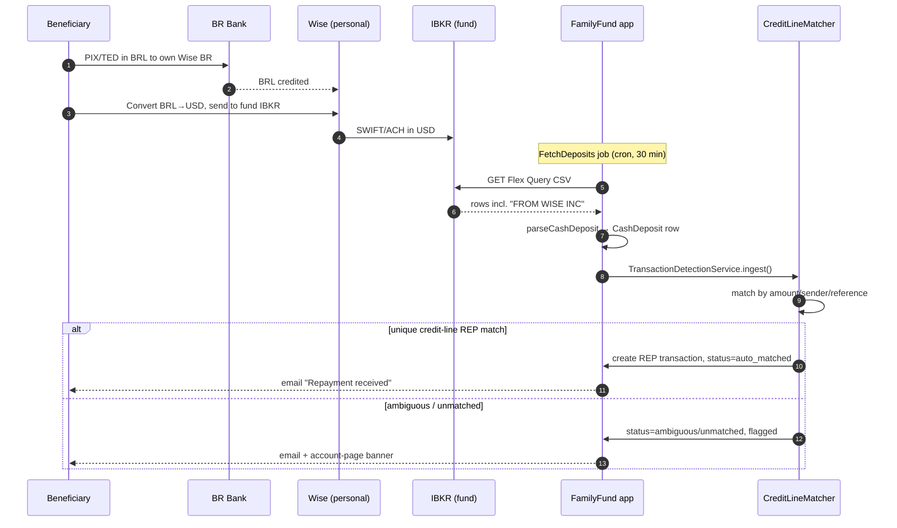
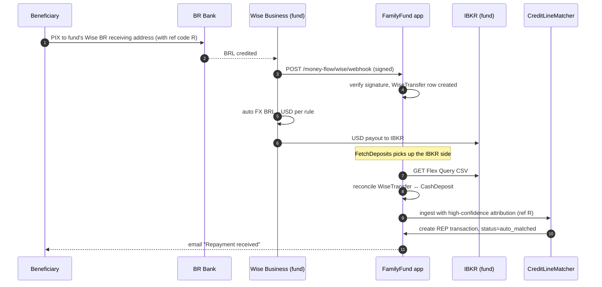
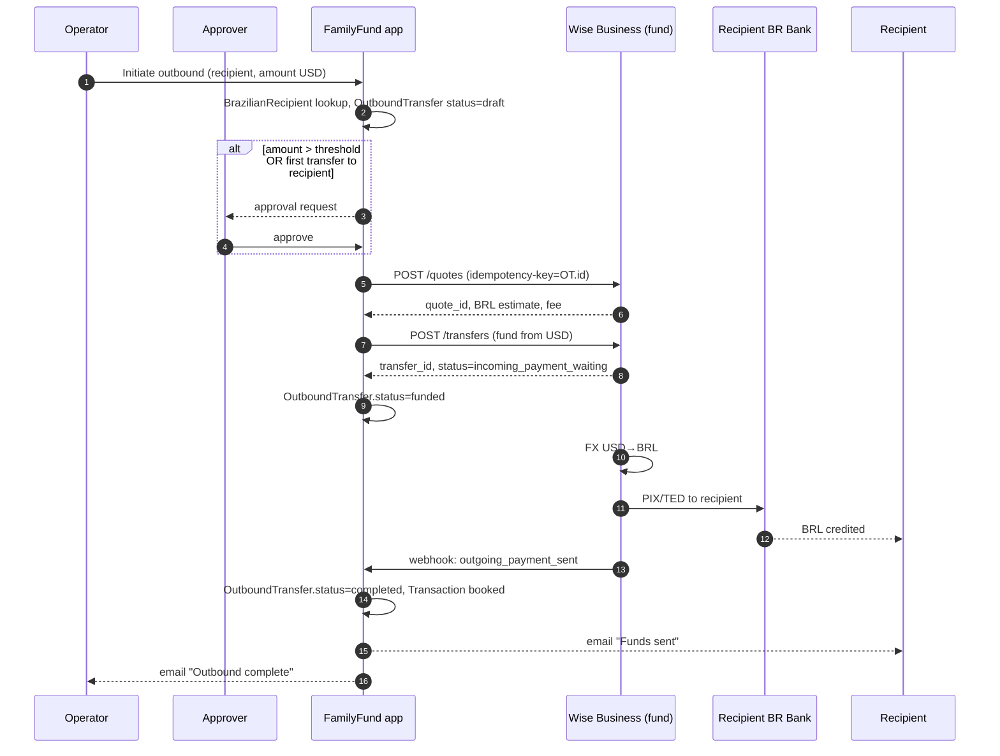
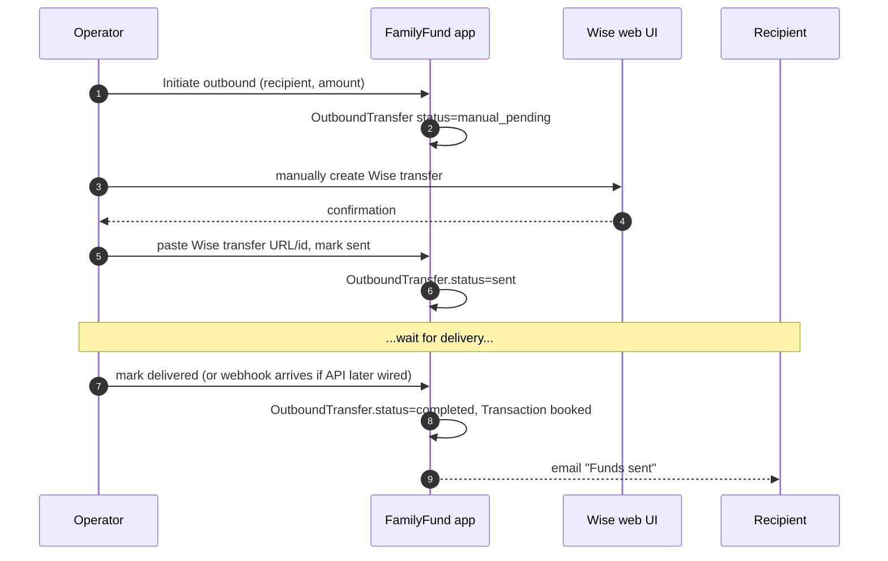

# Money Flow — Brazil ↔ US Fund — Planning Document

**Status:** Draft / sub-project proposal — not yet scoped for implementation
**Last Updated:** 2026-05-13 (rev 1)
**Branch:** `claude/plan-credit-lines-cCjWG`
**Related docs:** [`Transactions.md`](Transactions.md), [`app1/family-fund-app/docs/FAMILYFUND_TRANSACTION_SYSTEM.md`](app1/family-fund-app/docs/FAMILYFUND_TRANSACTION_SYSTEM.md), [`credit_lines_plan.md`](credit_lines_plan.md)

---

## 1. Goal

Design an end-to-end money-flow subsystem so that:

1. **Inbound** — a beneficiary in Brazil can pay BRL from their Brazilian bank (PIX or otherwise), have it converted and routed to the fund's USD bank/broker account, and have the system **automatically detect** the arrival, attribute it to the beneficiary, and book the right `CashDeposit` / `Transaction` (likely a credit-line `REP` per `credit_lines_plan.md`).
2. **Outbound** — the fund can automatically (or semi-automatically) send USD/BRL to a beneficiary's Brazilian bank account (PIX or Wise transfer) when they take a credit-line draw or a withdrawal.
3. **Registry** — the system stores Brazilian recipient information (PIX keys, bank/agency/account, CPF) so outbound transfers can be initiated programmatically.
4. **Isolation** — the entire money-flow subsystem lives in its own namespace, has its own queue, its own audit log, and stricter access controls than the rest of the app.

This document is a starting point. It maps the existing infrastructure, proposes options ranked by complexity, and lists what still needs decisions before implementation.

---

## 2. What already exists

The codebase has a working CSV-driven inbound pipeline. Key pieces:

| Component | Location | What it does |
|---|---|---|
| `CashDeposit` / `CashDepositExt` | `app/Models/` | Records an incoming cash deposit at the fund's broker (IBKR). Status flow: `PENDING` → `DEPOSITED` → `ALLOCATED` → `COMPLETED`. |
| `DepositRequest` / `DepositRequestExt` | `app/Models/` | Beneficiary's request to deposit money into the fund — pairs with a `CashDeposit` when reconciled. |
| `CashDepositTrait::parseCashDeposit()` | `app/Http/Controllers/Traits/CashDepositTrait.php:76-191` | Parses an Interactive Brokers Flex Query CSV (cols: `ClientAccountID`, `Description`, `SettleDate`, `Amount`, `TransactionID`, `ClientReference`) and creates `CashDeposit` rows. Already recognizes "FROM WISE INC" entries in test data. |
| `FetchDeposits` job | `app/Jobs/FetchDeposits.php` | Pulls deposits from IBKR per `TradePortfolio.tws_query_id` / `tws_token`, parses, and emails confirmation / errors. Not currently scheduled — runs on demand. |
| Cash-deposit UI | `routes/web.php` | `GET/POST /cashDeposits/{id}/assign`, `tradePortfolios/{id}/preview_deposits`, `do_deposits` — manual reconciliation UI. |
| `TransactionExt::FLAGS_CASH_ADDED = 'C'` | `app/Models/TransactionExt.php:39` | Flag used when cash was already in the fund (wire received) — share-value recalc excludes that deposit. Used by `CashDepositTrait.php:155`. |
| `TransactionExt::FLAGS_ADD_CASH = 'A'` | `app/Models/TransactionExt.php:38` | Flag used when the deposit also adds cash to the portfolio's CASH asset. |
| `TransactionMatching` + `MatchingRule` | `app/Models/` | The matching subsystem (parental contributions) — relevant because the same primitives will route detected deposits to credit-line REPs (see `credit_lines_plan.md` §10). |
| Existing docs | `Transactions.md`, `docs/FAMILYFUND_TRANSACTION_SYSTEM.md` | Describe transaction types, flags, and cash-position math. |

**What is NOT in place:**
- No multi-currency support — every amount is treated as USD; `FXRateToBase = 1` everywhere in tests.
- No registry of external bank accounts or recipients.
- No outbound payment integration of any kind.
- No webhook receiver; everything is poll-based.
- No `FetchDeposits` schedule — the job exists but doesn't run automatically.
- No Brazilian-payment-specific code (no PIX, no BRL, no CPF validation).

---

## 3. Design assumptions and constraints

| Constraint | Implication |
|---|---|
| Fund's brokerage is at **Interactive Brokers (US)**, holding USD. | All inbound BRL must convert to USD before arriving. All outbound to BR must convert USD → BRL. |
| FamilyFund app stack is Laravel 11 on Docker; deployed on a single private server. | No serverless edge functions; webhook receivers must be exposed via the Laravel app. |
| Outgoing-money operations are **high-stakes and infrequent**. | Optimize for safety (idempotency, approval flows, audit), not throughput. |
| The system is family-scale, not commercial. | A single bank/fintech partner per direction is fine. No need for a routing engine. |
| Brazilian financial regulation (Banco Central) and US compliance (OFAC, FinCEN) are **non-negotiable**. | Out of scope for this doc to design, but the proposal must leave room for KYC, transaction reporting, and per-recipient limits. Flag for legal review before any live deployment. |

---

## 4. End-to-end flow — inbound (Brazil → Fund)

The realistic ways money gets from a beneficiary's BR bank into the fund's IBKR USD account:

### 4.1 Path A — Wise personal transfer (v1, lowest complexity) ✅ recommended for v1

Beneficiary does a one-off Wise transfer themselves. No FamilyFund integration with Wise required; we detect via the existing IBKR pipeline.

```
[Beneficiary BR bank]
       │ PIX or TED in BRL
       ▼
[Beneficiary's Wise account]
       │ FX BRL→USD (Wise mid-market + fee)
       ▼
[Wise → IBKR via SWIFT or ACH]
       │
       ▼
[IBKR USD cash position]
       │ next FetchDeposits run pulls Flex Query
       ▼
[CashDeposit row created]  ──▶ existing matching UI / credit-line auto-matcher (§5 below)
```

**What we build:**
- Schedule `FetchDeposits` to run every 30 min (Laravel scheduler).
- Extend `CashDepositTrait::parseCashDeposit()` to recognize Brazil-origin markers in the `ClientReference` / `Description` fields (e.g., "FROM WISE INC", "WISE TRANSFER", optional reference codes) and tag the row with `origin = 'wise_br'`.
- Auto-match to credit-line `REP`s via the `TransactionDetectionService` from `credit_lines_plan.md` §10.

**What's required from the beneficiary:**
- Each beneficiary registers their Wise account once (so the system can recognize the sender). Optionally a per-payment reference code that the beneficiary copies into Wise's "reference" field.

**Why this is v1:** zero new external integrations, leverages an existing pipeline, and Wise already handles the FX and BR-banking complexity.

### 4.2 Path B — Wise Business API (v2, automation)

Same flow, but **FamilyFund holds a Wise Business account in the fund's name** and uses the Wise API to:
- Detect inbound transfers earlier (Wise notifies us before settlement at IBKR).
- Provide the beneficiary with a unique "memo / reference" per expected payment, so attribution is automatic instead of fuzzy-matched.
- Pull FX rate metadata (the actual rate Wise used, both sides of the conversion).

```
[Beneficiary BR bank]
       │ PIX/TED in BRL with reference code R
       ▼
[Fund's Wise Business account, BRL receiving]
       │ webhook: incoming transfer with reference R
       ▼
[Webhook receiver in App\MoneyFlow]
       │ idempotent record of WiseTransfer row, status=received
       ▼ Wise auto-converts BRL→USD per pre-set rule
[Wise USD balance]
       │ Wise scheduled transfer to IBKR
       ▼
[IBKR USD cash position]
       │ FetchDeposits reconciles WiseTransfer ←→ CashDeposit
       ▼
[matched, status=completed]
```

**What we build (additional to Path A):**
- A Wise Business API client (rate-limited, idempotent, signed).
- A webhook receiver: `POST /money-flow/wise/webhook` with signature verification.
- A `WiseTransfer` model: id, direction, amount_brl, amount_usd, fx_rate, wise_id, status (`received` / `converting` / `paid_out` / `failed`), webhook payload (encrypted JSON).
- Reconciliation logic: pair `WiseTransfer` (Wise side) with `CashDeposit` (IBKR side) when both land.

### 4.3 Path C — Brazilian fintech partner (v3, native PIX)

Most aggressive: a Brazilian fintech (BS2, Stark Bank, Inter, or Wise's own BR licence) gives us a fund-owned BR account that receives PIX directly. Their API notifies us on each PIX. The partner converts BRL → USD and remits to IBKR.

**Why this is v3:** requires the fund to be legally registered to hold a BR account (CNPJ or equivalent), a banking relationship with a BR fintech, and KYC/compliance work. Significant before-you-code work; out of scope for v1.

### 4.4 Detection mechanism summary

The detection seam is **`TransactionDetectionService::ingest($transaction)`** from `credit_lines_plan.md` §10.2. Money-flow inbound feeds it via two parallel streams:

| Source | Trigger | Creates |
|---|---|---|
| IBKR Flex Query (Path A always; Path B as the final reconcile) | `FetchDeposits` job on a 30-min schedule | `CashDeposit` row + may auto-attach a `WiseTransfer` from Path B |
| Wise webhook (Path B/C) | `POST /money-flow/wise/webhook` | `WiseTransfer` row, then later a `CashDeposit` when settled at IBKR |

Each detected event flows through:

```
Detector → CashDeposit row → DepositRequest match (existing UI) OR
                          ↘ CreditLineMatcher (auto-match to REP) → Transaction
                                                                       ↓
                                                          §8.6 transaction emails
```

---

## 5. End-to-end flow — outbound (Fund → Brazil)

Outbound is triggered by credit-line draws (`credit_lines_plan.md` §5 rule 2: "Move cash out of fund to borrower"), withdrawals, or matching disbursements.

### 5.1 Path A — Wise Business API outbound (recommended for v1 of outbound) ✅

```
[Fund operator approves outbound]
       │ amount in USD + recipient_id
       ▼
[MoneyFlow service: OutboundTransfer.create()]
       │ pulls recipient from BrazilianRecipient registry
       │ calls Wise quotes API → quote_id + estimated BRL
       │ creates WiseTransfer row status=quoted
       ▼
[Wise transfers API: fund the transfer from USD balance]
       │ idempotency key = OutboundTransfer.id
       ▼
[Wise: BRL→PIX to recipient's BR account]
       │ webhook updates: funds_converted, outgoing_payment_sent, completed
       ▼
[OutboundTransfer.status = completed]
       │ records the Transaction (SAL or BOR per context) with link
       ▼
[Recipient gets BRL in their account]
```

**Requirements:**
- Fund holds a **Wise Business USD account** (separate from beneficiary Wise accounts).
- A pre-approval flow gates all outbound: amounts above $X require a second user's approval (2FA).
- Idempotency keys on every Wise API call so retries are safe.
- Daily reconciliation: sum of outbound `WiseTransfer` rows should match Wise statement debits.

### 5.2 Path B — Manual + record (v0 stub)

For the very first cut, the operator does the Wise transfer manually through Wise's web UI; the FamilyFund app just **records** it via a form. This unblocks outbound functionally before Path A is built.

```
[Operator initiates manual Wise transfer]
       │ records in FamilyFund: OutboundTransfer (status=manual, external_ref=wise_url)
       ▼
[Beneficiary receives BRL]
       │ operator marks complete in app
       ▼
[OutboundTransfer.status = completed]
```

**Why this matters:** even Path B benefits from the registry (§6) and audit log (§8.4) — it just skips the API automation.

### 5.3 Path C — Direct PIX via BR fintech (v3)

Same as inbound Path C but reversed: fund's BR account sends PIX to recipient. Out of scope until inbound Path C is in.

---

## 6. Recipient registry (`BrazilianRecipient`)

A new model in the isolated `App\MoneyFlow` namespace. All sensitive columns encrypted at rest using Laravel's `encrypted` cast.

| Field | Type | Notes |
|---|---|---|
| `id` | bigint PK | |
| `account_id` | FK → `accounts.id` | Which beneficiary account this recipient belongs to. |
| `display_name` | string | "Maria — Itaú checking" |
| `full_legal_name` | string (encrypted) | Required by FX providers for AML. |
| `document_type` | enum | `CPF` / `CNPJ`. |
| `document_number` | string (encrypted) | Validated by check-digit algorithm. |
| `pix_key_type` | enum nullable | `cpf` / `email` / `phone` / `random` / NULL. |
| `pix_key` | string (encrypted, nullable) | Required if outbound goes via PIX. |
| `bank_code_ispb` | string nullable | Brazil Central Bank ISPB code. |
| `bank_agency` | string nullable | |
| `bank_account_number` | string (encrypted, nullable) | |
| `bank_account_type` | enum nullable | `checking` / `savings`. |
| `wise_recipient_id` | string nullable | If created on Wise side. |
| `direction` | enum | `inbound` (we expect them to send), `outbound` (we send to them), `both`. |
| `status` | enum | `active` / `disabled` / `pending_verification`. |
| `verified_at` | datetime nullable | Set after first successful transfer. |
| `created_by_user_id` | FK → `users.id` | Audit. |
| timestamps | | |

**Rules:**
- An account can have **many** recipients (one for each BR account they own — checking + savings, for example).
- A recipient with `direction = inbound` is used by the detector to **attribute** detected inbound transfers to the right beneficiary (sender match by Wise account name, CPF, etc.).
- A recipient with `direction = outbound` is selectable when the operator initiates a transfer.
- First outbound to a new recipient is **always manual / approval-gated** (Path B) regardless of amount. Subsequent outbounds can auto-flow once `verified_at` is set.

---

## 7. Subsystem isolation (`App\MoneyFlow`)

Money flow is a high-blast-radius subsystem. Treat it like a vault, not like the rest of the app.

### 7.1 Code isolation

- All new code lives under `app1/family-fund-app/app/MoneyFlow/` with PSR-4 namespace `App\MoneyFlow`.
- Public seam: a single `App\MoneyFlow\Facade` that the rest of the app calls. Direct DB access from outside the namespace is **disallowed** (enforced by code review + a Pest architecture test).
- Models, services, jobs, controllers, requests, mailers all live inside.
- No business logic from `App\Models\TransactionExt` leaks in; the facade translates between domain `Transaction` and money-flow events.

### 7.2 Database isolation

Option (lighter): same DB, dedicated table prefix `mf_*` (`mf_brazilian_recipients`, `mf_wise_transfers`, `mf_outbound_transfers`, `mf_audit_log`, `mf_idempotency_keys`).

Option (heavier): separate Laravel database connection pointing to a different schema with restricted credentials. v1 keeps the lighter option to avoid migration headaches; the prefix gives us a clear quarantine boundary that we can split later.

### 7.3 Queue isolation

A dedicated queue connection `money_flow`. Jobs that talk to external money APIs run there only — never on `default`. Failures don't block account reports / quarterly mailers. Workers can be paused independently in an incident.

### 7.4 Secret isolation

- All API keys in `.env`, **never** in DB.
- Webhook signing secrets verified on every request — reject if invalid (no fallback paths).
- Logs sanitize all PII / financial fields via a Monolog processor.
- No PII in queue payloads — pass IDs, not values.

### 7.5 Authorization

- A new role `money_flow_operator` is required to initiate outbound transfers.
- A new role `money_flow_approver` is required to confirm outbound above a per-fund threshold.
- All inbound detection is system-driven (no user role needed) but the resolve / manual-match UI requires `money_flow_operator`.
- No silent self-approval — operator and approver must be different users.

### 7.6 Audit log

`mf_audit_log` is append-only (no UPDATE/DELETE). Fields: `actor_user_id`, `action`, `subject_type`, `subject_id`, `old_state` (encrypted JSON), `new_state` (encrypted JSON), `request_id`, `ip`, `ts`. Every external API call, every state transition, every operator action lands here. Retention: 7 years (typical compliance baseline; confirm with counsel).

### 7.7 Idempotency

Every external write API call (Wise quote, Wise pay, BR fintech) carries an idempotency key tied to a row in `mf_idempotency_keys`. Replays from the queue use the same key; the external service returns the same result.

---

## 8. Sequence diagrams

### 8.1 Inbound — Path A (Wise personal transfer detected via IBKR)



### 8.2 Inbound — Path B (Wise Business API with webhook)



### 8.3 Outbound — Path A (Wise Business API)



### 8.4 Outbound — Path B (manual + record)



---

## 9. Phased delivery

| Phase | Inbound | Outbound | Effort | Unblocks |
|---|---|---|---|---|
| **P0 — Schedule what exists** | `FetchDeposits` on a 30-min cron; CSV parser recognizes Wise origin and tags `origin='wise_br'` | Manual Path B with recording UI | S | Beneficiaries can pay; fund can disburse manually with an audit trail. |
| **P1 — Registry + attribution** | `BrazilianRecipient` model, attribution by sender name / reference; integrate with `CreditLineMatcher` | Operator UI uses registry for recipient selection | M | Auto-routes inbound to credit-line REPs; recipients are reusable. |
| **P2 — Wise Business API** | Wise webhook receiver, `WiseTransfer` model, IBKR reconciliation | Wise transfers API, approval flow, status polling | L | Hands-free in/out, FX captured, end-to-end <24h. |
| **P3 — Compliance + isolation hardening** | KYC checks at registry add, OFAC screening | Outbound limits per recipient / per period | M | Production-ready posture. |
| **P4 — Native PIX via BR fintech** | Direct PIX webhook from a BR fintech partner | Direct PIX outbound | XL | Real-time, sub-minute attribution; needs CNPJ + partner. |

Recommendation: ship **P0 + P1** in one go; **P2** as a second milestone. P3 is mandatory before any real money flows; P4 is optional and depends on volume.

---

## 10. Use case tracker (for the sub-project)

| ID    | Use case                                          | Phase | Status  |
|-------|---------------------------------------------------|-------|---------|
| MF-01 | Schedule `FetchDeposits` job (30-min cron)        | P0    | planned |
| MF-02 | Parser tags Wise-origin deposits                  | P0    | planned |
| MF-03 | Manual outbound recording UI + audit log          | P0    | planned |
| MF-04 | `BrazilianRecipient` model + CRUD                 | P1    | planned |
| MF-05 | Encrypted-at-rest columns for PII / financial     | P1    | planned |
| MF-06 | CPF check-digit validation                        | P1    | planned |
| MF-07 | Attribution: detected deposit → beneficiary via registry | P1 | planned |
| MF-08 | Auto-match detected deposit to credit-line REP     | P1    | planned |
| MF-09 | Wise webhook receiver with signature verification | P2    | planned |
| MF-10 | `WiseTransfer` model + inbound reconciliation     | P2    | planned |
| MF-11 | Wise quotes + transfers API client (idempotent)   | P2    | planned |
| MF-12 | Two-user approval flow for outbound > threshold   | P2    | planned |
| MF-13 | Outbound status polling + state machine           | P2    | planned |
| MF-14 | Money-flow audit log (append-only)                | P0–P2 | planned |
| MF-15 | Dedicated `money_flow` queue connection           | P0    | planned |
| MF-16 | `App\MoneyFlow` namespace + facade + arch test    | P0    | planned |
| MF-17 | Money-flow operator + approver roles              | P1    | planned |
| MF-18 | Daily reconciliation report (Wise vs IBKR vs DB)  | P2    | planned |
| MF-19 | OFAC / sanctions screen on recipient add          | P3    | planned |
| MF-20 | Per-recipient + per-period outbound limits        | P3    | planned |
| MF-21 | Direct BR-fintech PIX webhook                     | P4    | planned |
| MF-22 | Direct BR-fintech PIX outbound                    | P4    | planned |

---

## 11. Open questions for the user

These shape the proposal; the answers will tighten phases and the registry schema:

1. **Is there a Wise Business account in the fund's name today, or just personal Wise accounts on the beneficiary side?** Determines whether P2 is a "create new banking relationship" task or just an API integration task.
2. **Is the fund legally able to hold a Brazilian bank account (CNPJ)?** Required for P4. If yes, which BR fintech are we considering (BS2, Stark Bank, Inter, Nubank Business)?
3. **What is the outbound approval threshold?** (Above this, two-user approval is required.) Default proposal: USD 500.
4. **Who is the "operator" and who is the "approver"?** Are these existing user roles or new ones to create? Are operator and approver always different humans or can a single admin self-approve below threshold?
5. **What FX rate is the system of record?** Wise's quoted mid-market, the actual conversion rate on the day, or a daily-fixed BACEN rate? Affects how `valueAsOf` and credit-line cash-leg math work.
6. **Retention period for audit + PII?** Proposal: 7 years for audit, indefinite for recipients while active. Confirm with counsel.
7. **Notification channels?** Today the app emails via MailHog (dev) and SMTP (prod). Should money-flow events also Slack / SMS the operator, or just email?

---

## 12. Risks and watch-items

- **Bank-side opacity.** IBKR Flex Query is the only window into the broker; if the CSV format changes silently, detection breaks. Mitigate with a daily CSV-shape validation test and an alert on parse-error rate.
- **FX rate ambiguity.** A BRL payment at 09:00 may convert at one rate and book at IBKR at another. The `WiseTransfer` row captures the rate used; surface this on the beneficiary's account page so they see the actual outcome.
- **Recipient verification.** A typo'd PIX key sends real money to a stranger. First outbound to a new recipient is always manual / approval-gated, and we wait for `verified_at` before allowing auto-flow.
- **Wise API rate limits and downtime.** Idempotent retries with exponential backoff; circuit-breaker after N failures.
- **Webhook spoofing.** Always verify signatures; reject on mismatch; alert on signature-fail rate spikes.
- **PII leakage in logs / errors.** Centralized Monolog processor strips known sensitive keys; periodic log-content audit.
- **Compliance drift.** Money transmission laws change. Phase P3 is mandatory not optional; do not push real money in P0/P1 without it.
- **Scope creep into a full payments system.** Resist building "a payment provider" — this is a family-scale routing layer, not a SaaS. The facade boundary in §7.1 helps enforce that.
