# Credit-Line UI Tour Screenshots — 2026-05-14

23 screenshots captured by `tests/Browser/CreditLineUITourTest.php` walking the full credit-line / borrowing flow on the live dev app (`http://localhost:3000`).

Test user: `claude@test.local` (admin). Target account: id 7 (Acct7, ~5391 OWN shares before the tour).

This directory is **temporary** — to be removed in a follow-up commit once reviewed.

> Re-captured after Phase 6 (`1af2c92`). Includes the post-fix trajectory chart (Original plan now steps by 20 as expected), and reflects all UC-20 / UC-37 / UC-46 / UC-47 wiring from Phase 6.

> **See also: [negative/](negative/)** — UI screenshots of all 8 error / authorization paths (non-admin access, validation errors, over-borrow, cancel-blocked, account-closure-blocked, no-change readjust, double-reverse).

---

## 01 — Account page before any credit line

## 01b — Same, widened to 1920px
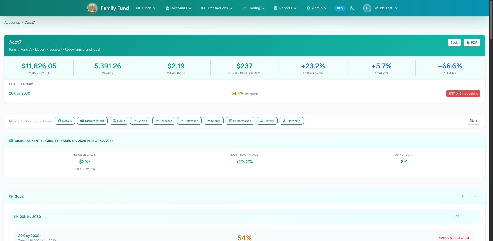

## 02 — Credit-lines index (empty for Acct7)
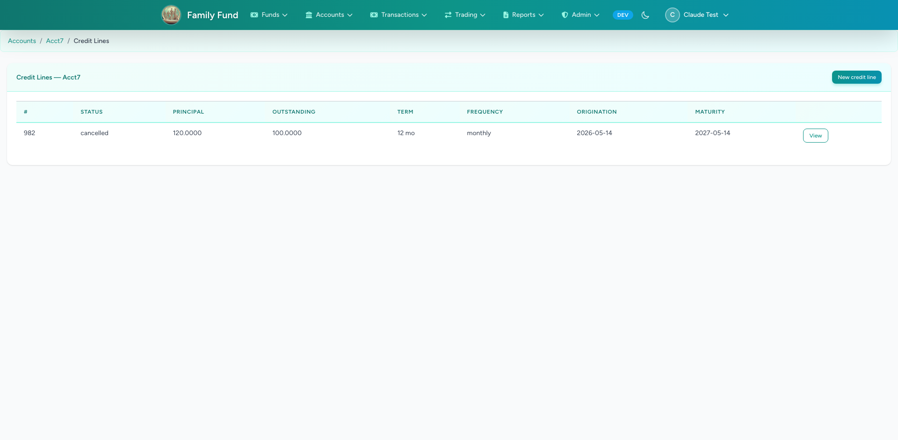

## 03 — "New credit line" form, blank
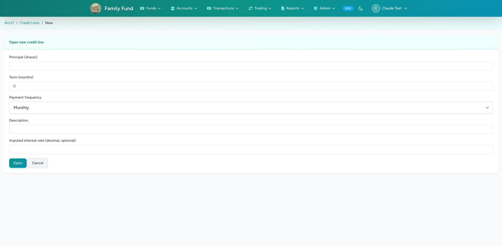

## 04 — Form filled (120 shares, 6 months, monthly)
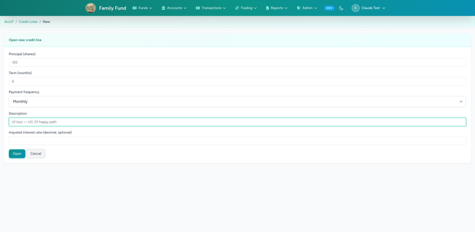

## 05 — Show page right after open
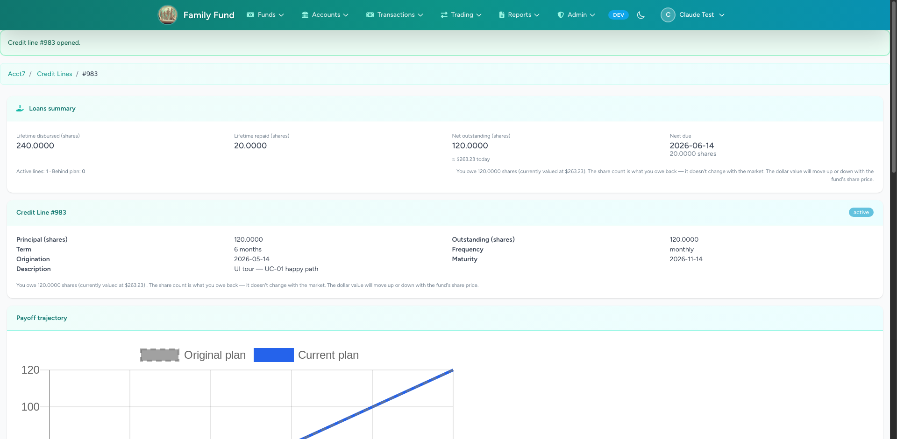

## 06 — Show page scrolled to schedule
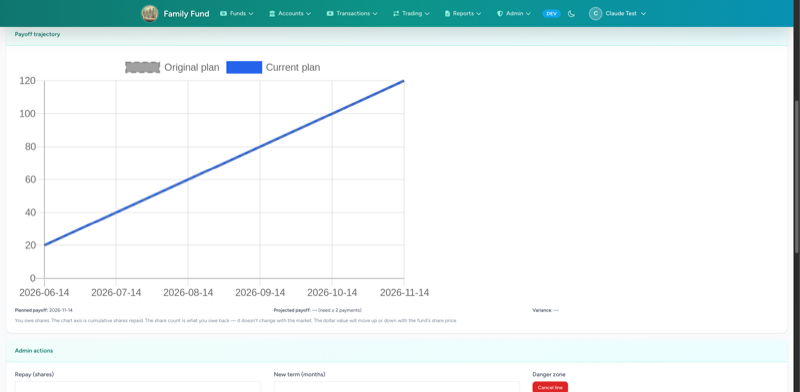

## 07 — Show page scrolled to adjustment history (empty until readjust)
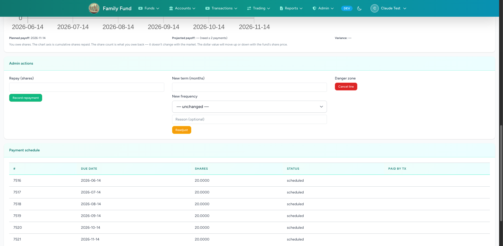

## 08 — Account page after the line exists
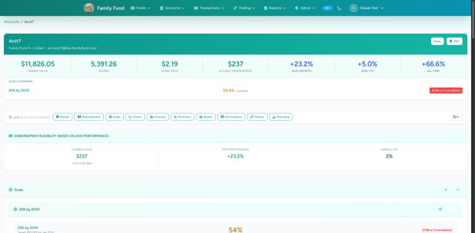

## 09 — Show page after first repayment (20 shares)
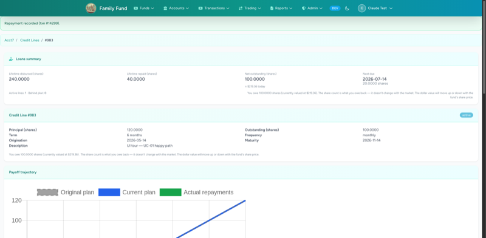

## 10 — Show page after second repayment (15 shares, partial)

## 11 — Schedule table after two repays
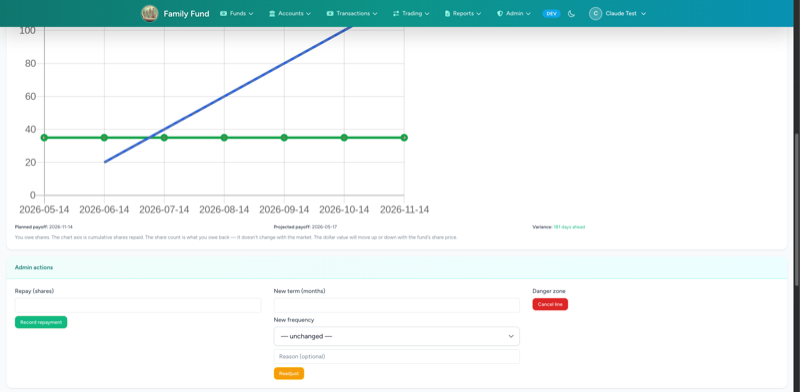

## 12 — Show page after readjust (6 → 12 months)
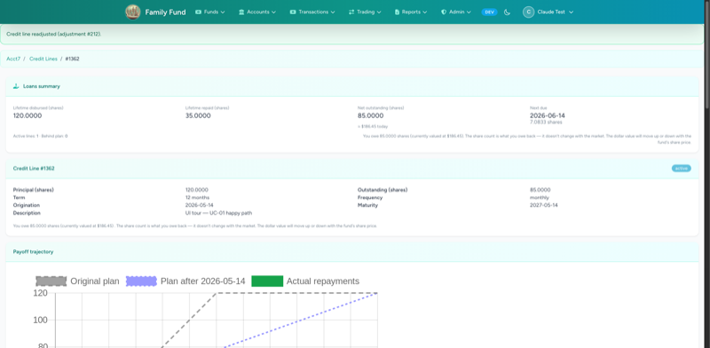

## 13 — Schedule after readjust: cancelled + new rows by due_date
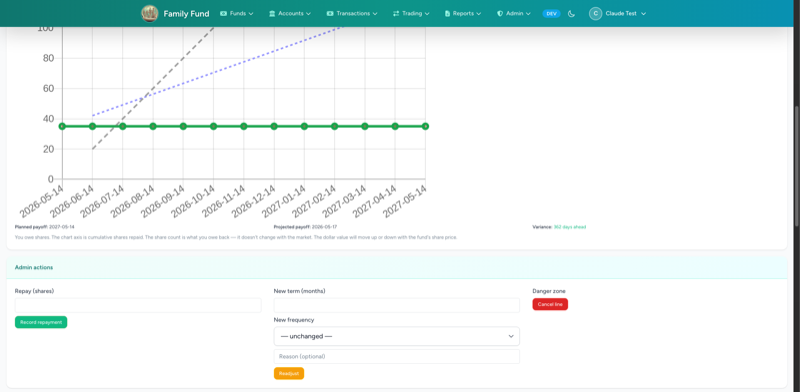

## 14 — Adjustment timeline entry with old → new diff
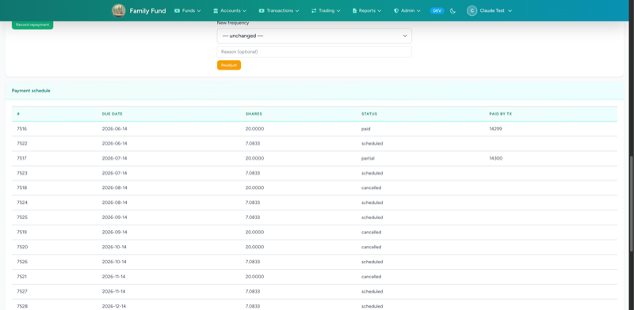

## 15 — Schedule snapshot modal (Phase 4 wiring)
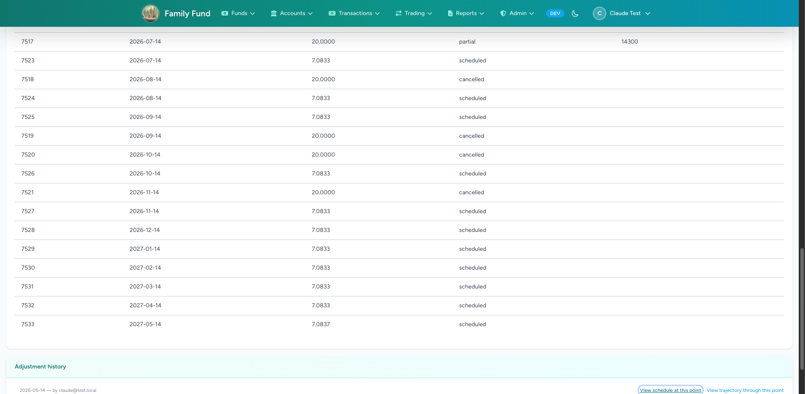

## 16 — Trajectory-at-point modal (Phase 4 wiring)
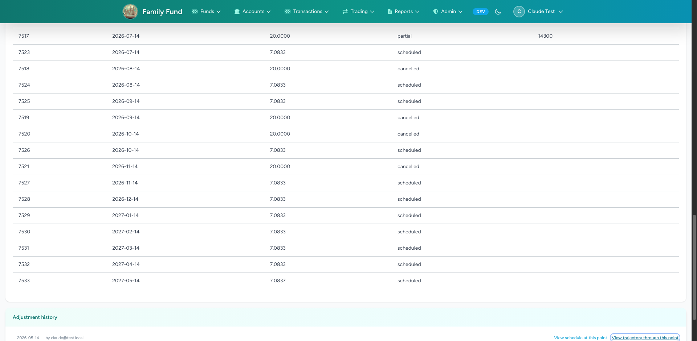

## 17 — Show page after reversing the partial REP
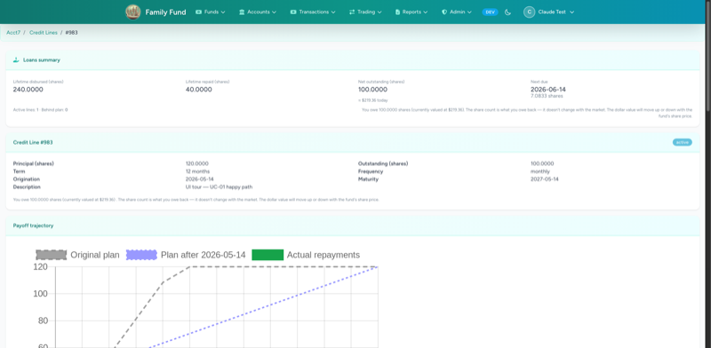

## 18 — Trajectory chart close-up
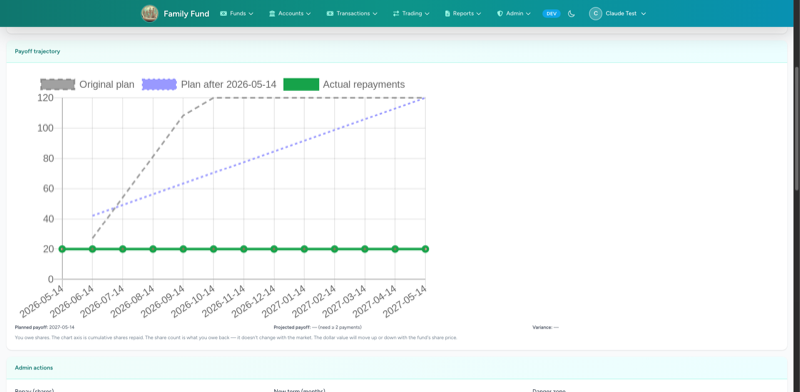
*Post-fix: "Original plan" now steps by 20 (correct), reaching 120 by month 6.*

## 19 — Fund show page, top

## 20 — Fund show page, bottom (admin "Cash position" panel)

## 21 — Account quarterly PDF (today)
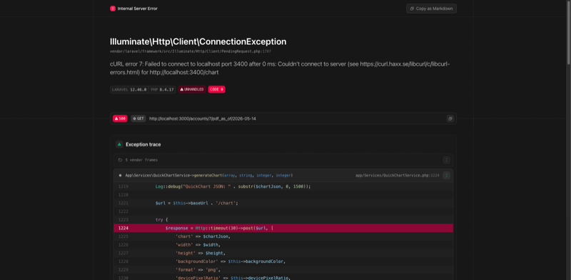

## 22 — Fund quarterly PDF (today)
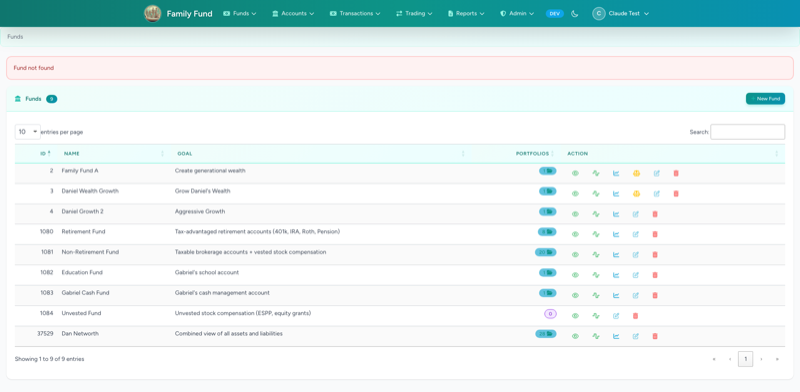

---

## Bugs spotted during this tour

See `credit_lines_bugs_found.md` (repo root) for the full catalog with statuses and regression tests.
