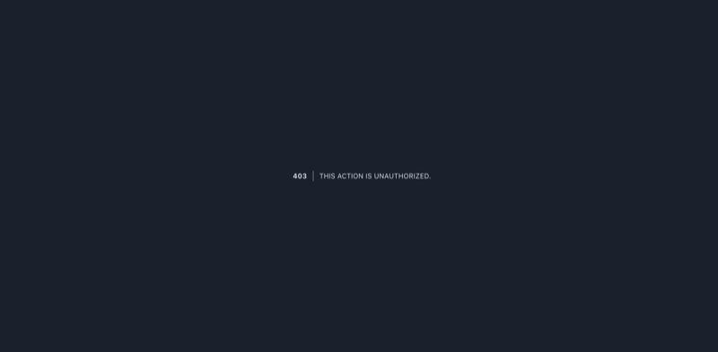
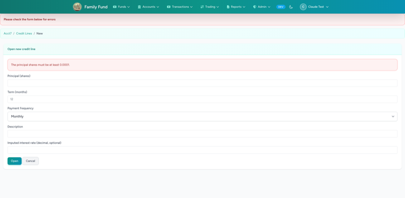
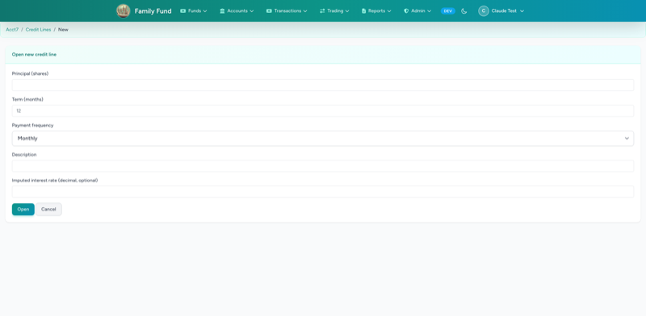
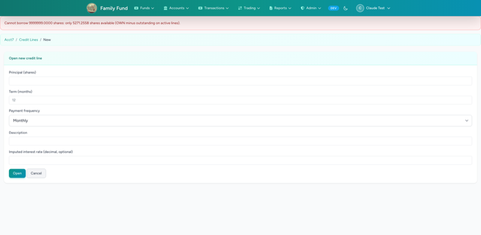
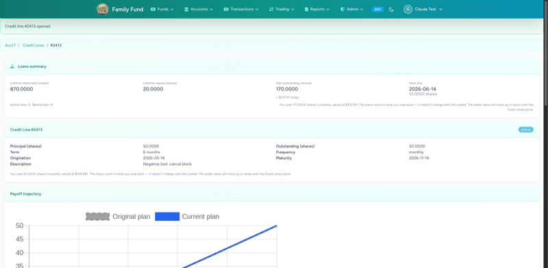
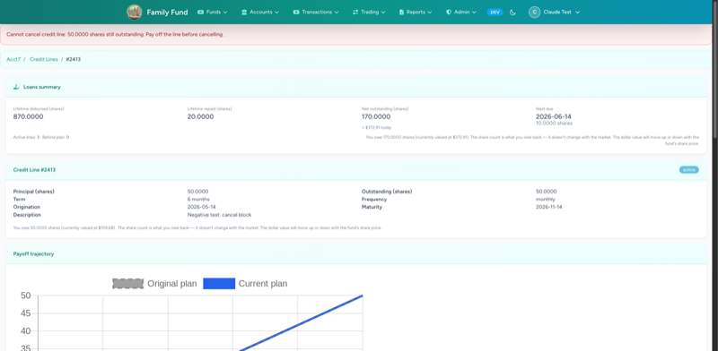
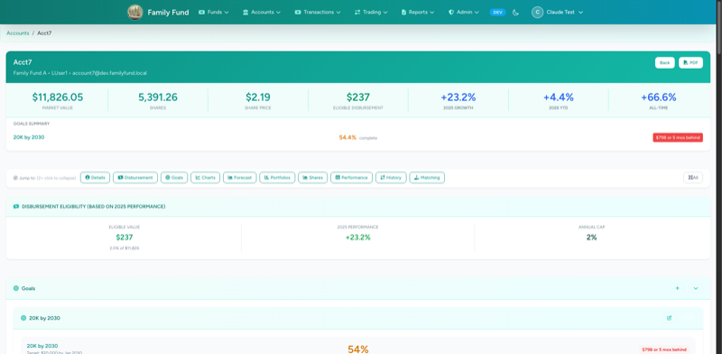
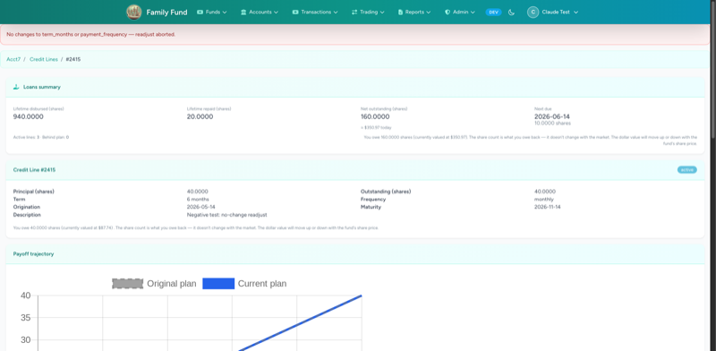
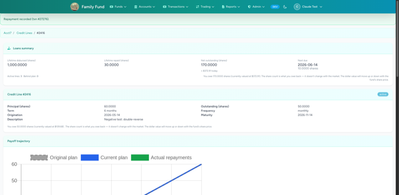
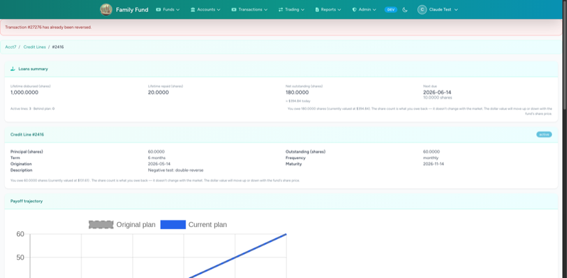

# Credit-Line Negative-UI Screenshots — 2026-05-14

17 screenshots captured by `tests/Browser/CreditLineNegativeUITest.php`.
Each test exercises a user-error or authorization path through the real
browser and screenshots both the *before* state (form loaded) and the
*after* state (the error / blocked state) so you can see how the UI
reacts.

This directory is **temporary** — to be removed in a follow-up cleanup
commit.

---

## 01 — Non-admin user tries to create a credit line
**Before — non-admin POSTs to create:**

**After — 403 forbidden:**

## 02 — Negative principal_shares
**Form loaded:**

**After submit with negative principal — validation error:**

## 03 — term_months = 0
**Form loaded:**

**After submit with zero term — validation error:**

## 04 — Over-borrow (more than account's available-to-borrow)
**Form loaded:**

**After submit — flash "Cannot borrow":**

## 05 — Cancel active line that still has outstanding shares
**Line is active with outstanding > 0:**

**After cancel attempt — flash error, line stays active:**

## 06 — Delete account that has an active credit line (UC-47)
**Account show page:**

**After DELETE attempt — closure-block error:**

## 07 — Readjust with no actual change
**Line before readjust:**

**After submit same term/frequency — flash "No changes":**

## 08 — Reverse the same REP transaction twice
**After one repay (REP exists):**

**After first reverse — REP marked reversed:**

**After second reverse attempt — flash "already been reversed":**

