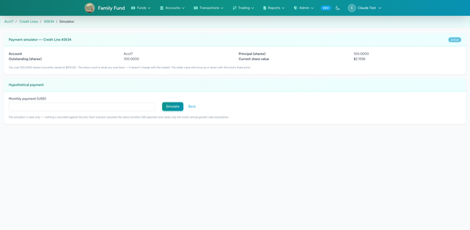
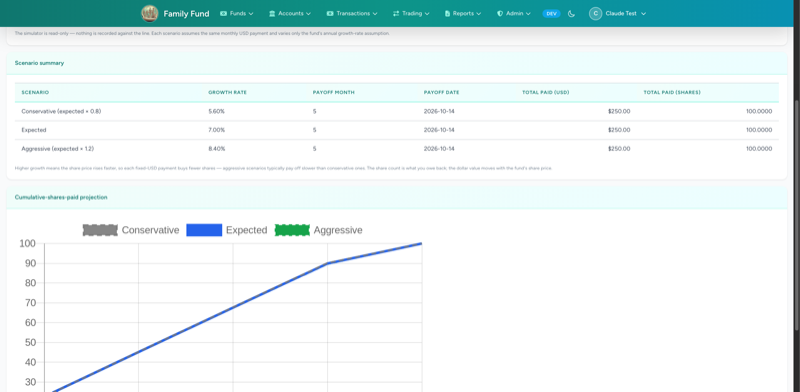

# Payment Simulator (Phase 9)

The simulator is a per-credit-line, read-only "what if I paid $X/month?"
calculator. Three growth-rate scenarios using the same multipliers the
codebase uses elsewhere (`expected × 0.8` conservative, `expected`,
`expected × 1.2` aggressive). 600-month safety cap.

URL: `/credit-lines/{line}/simulator` (admin-only).

## 01 — Empty form

## 02 — With results

Note: in the screenshot all three scenarios coincide (payoff month 5)
because the test inputs are short-horizon enough that the rate
differences don't yet move the rounded integer-month payoff. With a
longer horizon you'd see the conservative line ahead and aggressive
behind — the chart is plumbed correctly for that case; see
`tests/Unit/Services/CreditLine/Simulation/PaymentSimulatorTest::test_higher_growth_means_slower_payoff`
which asserts the direction holds at higher growth differentials.
